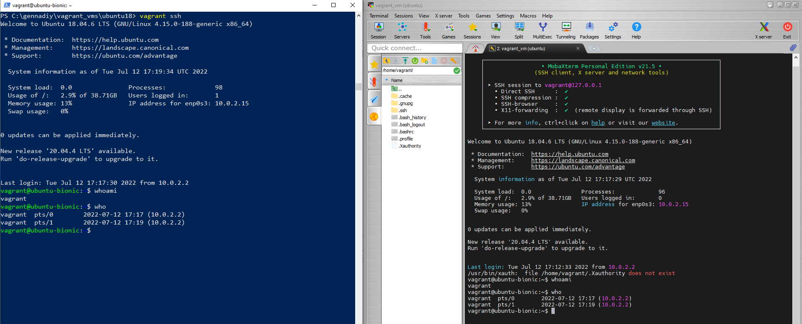

# Module 2. Virtualization and Cloud Basic

## TASK 2.1

### PART 1. HYPERVISORS

1. What are the most popular hypervisors for infrastructure virtualization?

- KVM (Kernel-Based Virtual Machine) / RHEV (Red Hat Enterprise Virtualization)
- Xen / Citrix XenServer
- Microsoft Hyper-V
- VMware vSphere / ESXi

2. Briefly describe the main differences of the most popular hypervisors.

A hypervisor abstracts operating systems and applications from their underlying hardware.

A Type 1 hypervisor runs directly on the host machine's physical hardware, and it's referred to as a bare-metal hypervisor. The Type 1 hypervisor doesn't have to load an underlying OS. With direct access to the underlying hardware and no other software -- such as OSes and device drivers, Type 1 hypervisors are regarded as the most efficient and best-performing hypervisors available for enterprise computing. Hypervisors that run directly on physical hardware are also highly secure. Virtualization mitigates the risk of attacks that target security flaws and vulnerabilities in OSes because each guest has its own OS. This ensures an attack on a guest VM is logically isolated to that VM and can't spread to others running on the same hardware. Type 1 hypervisors are used for production-level workloads.

A Type 2 hypervisor is typically installed on top of an existing OS. It is sometimes called a hosted hypervisor because it relies on the host machine's preexisting OS to manage calls to CPU, memory, storage and network resources. The presence of an underlying OS with Type 2 hypervisors introduces unavoidable latency; all of the hypervisor's activities and the work of every VM has to pass through the host OS. Also, any security flaws or vulnerabilities in the host OS could potentially compromise all of the VMs running above it. Type 2 hypervisors are generally not used for data center computing and are reserved for client or end-user systems

Examples of Type 1 hypervisors:

KVM (or Kernel-Based Virtual Machine) is open source virtualization architecture made for Linux distributions. RHEV is a commercial implementation of the KVM Type-1 hypervisor.

XenServer is a commercial tier-1 hypervisor solution from Citrix. Amazon Web Services uses a customized version of the Xen hypervisor as the foundation for its Elastic Compute Cloud.

Microsoft Hyper-V runs on Windows OSes.

VMware vSphere includes the ESXi hypervisor and vCenter management software to provide a suite of virtualization products. VMware vSphere is geared toward enterprise data centers.

Examples of Type 2 hypervisors:

VirtualBox supports a variety of host OSes, such as Windows, Apple macOS, Linux and Oracle Solaris.

VMware Workstation Pro and VMware Fusion. VMware Workstation Pro is a 64-bit hosted hypervisor capable of implementing virtualization on Windows and Linux systems. VMware Fusion is macOS compatible.

### PART 2. WORK WITH VIRTUALBOX

1. First run VirtualBox and Virtual Machine (VM).

- Creation new and clone of the existing VM

- Keyboard shortcuts - HOST (`ctrl right`) key combinations examples:

| command    | description                    |
| :--------- | :----------------------------- |
| HOST + Del | equivalent of Ctrl + Alt + Del |
| HOST + F   | go to full screen              |
| HOST + C   | enable scaled mode             |
| HOST + Q   | close virtual machine          |
| HOST + T   | take snapshot                  |
| HOST + E   | take screenshot                |
| HOST + P   | stop/pause                     |
| HOST + R   | reboot/reset                   |
| HOST + S   | settings                       |

- Create a group of two VM

- Branched tree of snapshots

- Export VM (saving .ova file to disk)

- Import VM from .ova file

2. Configuration of virtual machines

2.2 Configure the USB to connect the USB ports of the host machine to the VM[1, ch.3.11].

- Mount shared folder

- Network modes

Networking Modes Tests:

| mode      | VM -> Host | VM <- Host | VM1 <-> VM2 | VM -> Net | VM <- NET |
| :-------- | :--------: | :--------: | :---------: | :-------: | :-------: |
| NAT       |     +      |  port fwd  |      -      |     +     | port fwd  |
| Bridged   |     +      |     +      |     (?)     |     +     |     +     |
| Internal  |     -      |     -      |      +      |     -     |     -     |
| Host-Only |     +      |     +      |     (?)     |     -     |     -     |

Add static IP address to VM (internal network):

`ifconfig enp0s3 192.168.1.10 netmask 255.255.255.0 up`

See IP routing table:

`route -n`

Ping example: `ping -c 5 reqres.in`

3. Work with CLI through VBoxManage.

#### Basic commands of VBoxManage examined and played with (selectively):

- `VBoxManage list vms`
- `VBoxManage showvminfo Ubuntu_srv_01`
- `VBoxManage startvm Ubuntu_srv_01`
- `VBoxManage controlvm Ubuntu_srv_01 pause` (resume/reset/poweroff//usbattach|usbdetach <uuid|address/>)

- `VBoxManage snapshot Ubuntu_srv_02 take` (delete|restore <snapshot>)
- `VBoxManage snapshot Ubuntu_srv_02 list`
- `VBoxManage clonevm Ubuntu_srv_01 --name=Ubuntu_srv_03 --register --snapshot="docker-group-added"`

- `VBoxManage createvm --name Ubuntu_srv_04 --ostype Ubuntu_64 --register`

- `VBoxManage modifyvm Ubuntu_srv_02 --name Ubuntu_srv_05`
  (--groups <group>
  --ostype <ostype>
  --memory <memorysize>
  --usb on|off
  --usbrename <oldname> <newname>)

- `VBoxManage unregistervm Ubuntu_srv_33 --delete`
- `VBoxManage export Ubuntu_srv_05 -o ub5.ova --vsys 0`
- `VBoxManage import ub5.ova --dry-run`

- `VBoxManage sharedfolder add <vmname> --name=<sharedfoldername> --hostpath=<hostpath>`
- `VBoxManage sharedfolder remove <vmname> --name=<sharedfoldername>`
- `VBoxManage metrics setup --period 1 --samples 5 host CPU/Load,RAM/Usage`
- `VBoxManage metrics list` (query)

### PART 3. WORK WITH VAGRANT

- Vagrant up ('ubuntu/focal64')

- Vagrant ssh ('ubuntu/focal64'). Record the date and time by executing the date command

#### Vagrant commands examined and played with:

### Vagrant commands

- `vagrant up`
- `vagrant reload`
- `vagrant ssh-config `
- `vagrant ssh`
- `vagrant halt`
- `vagrant suspend`
- `vagrant status`
- `vagrant destroy`

#### SSH connect to VM by MobaXterm

