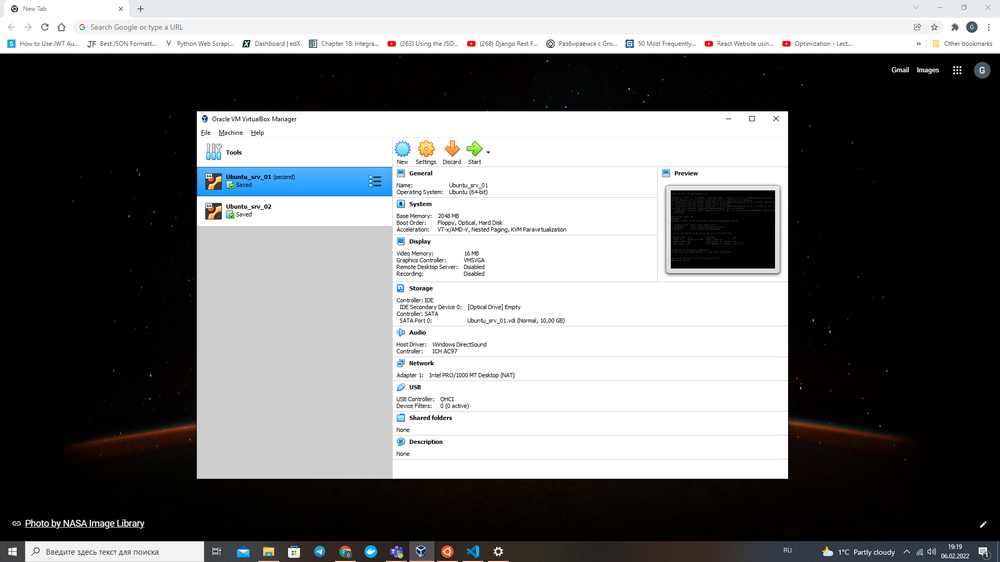
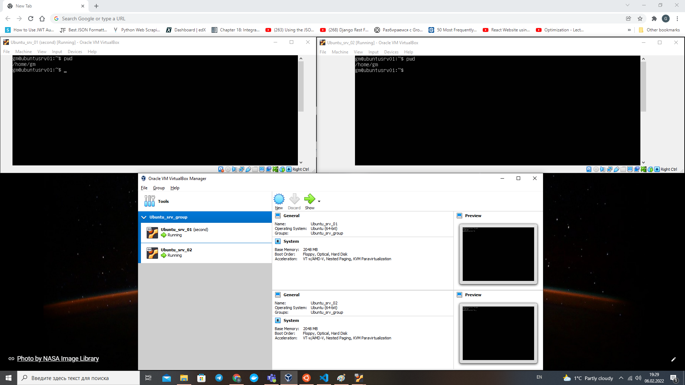
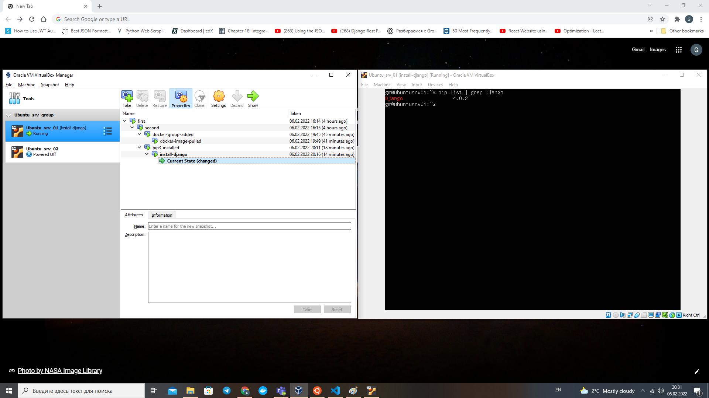
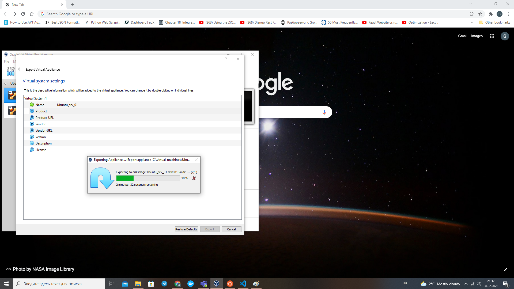
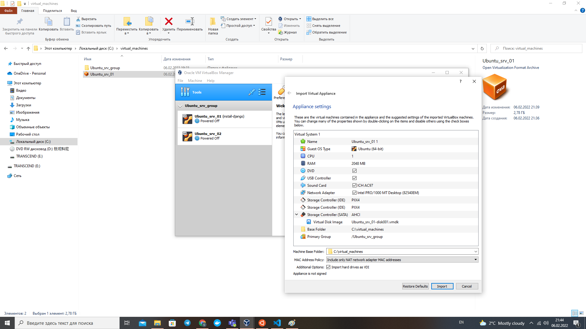
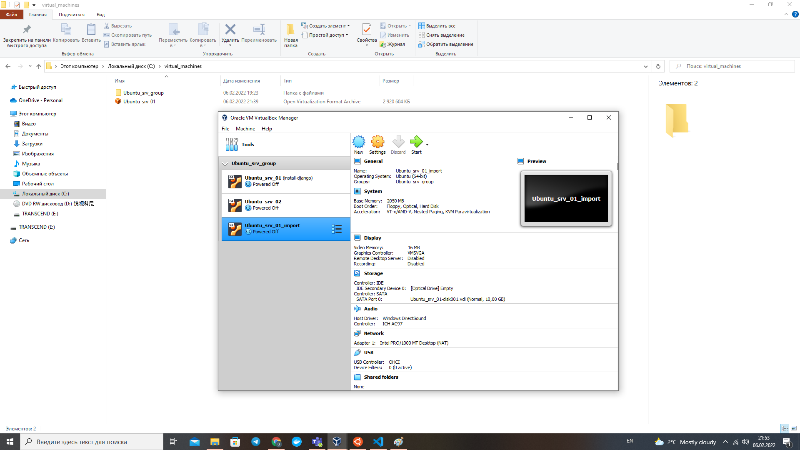
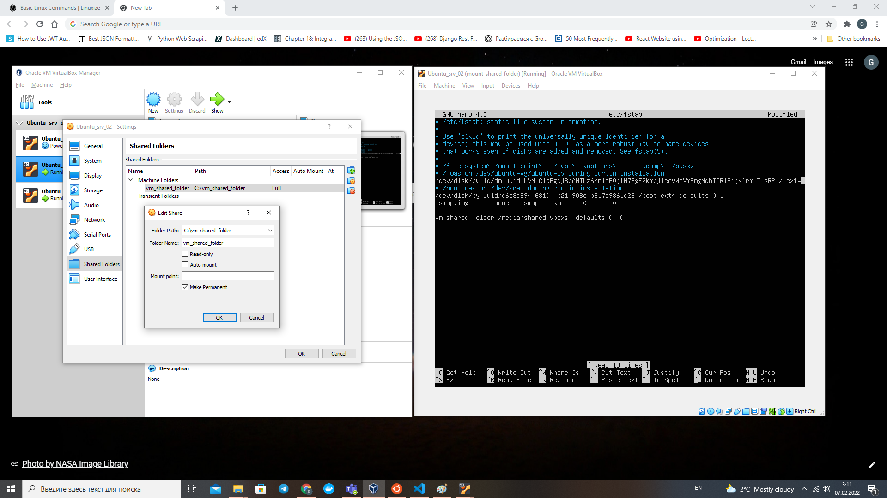
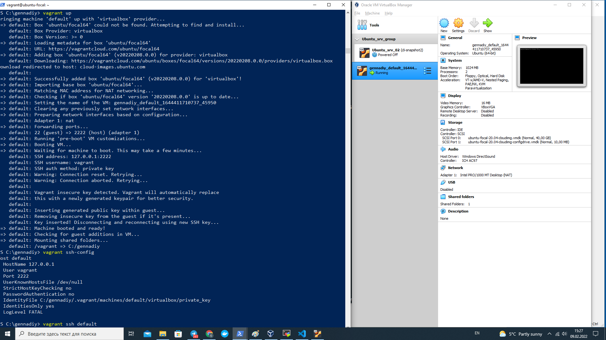
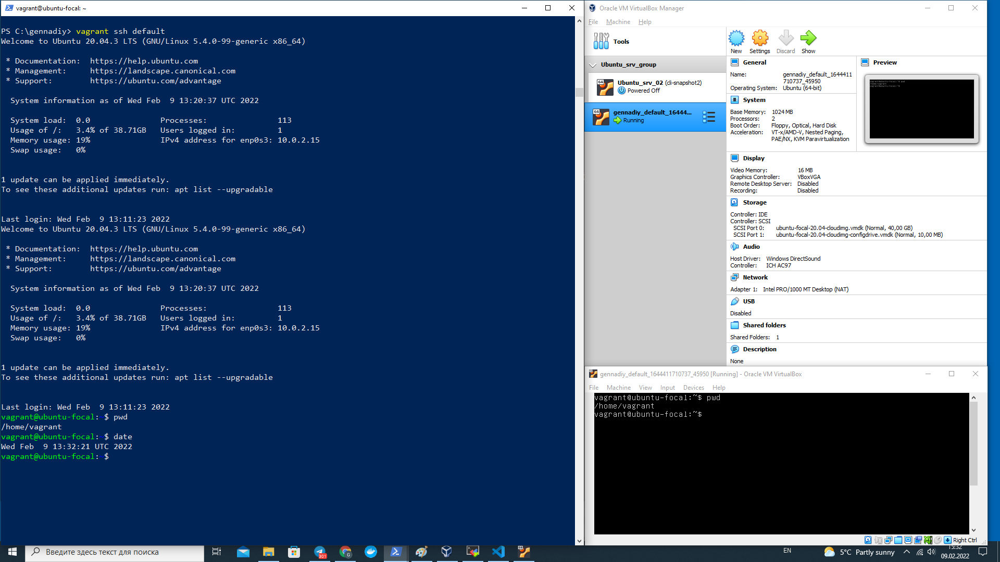

# Module 2. Virtualization and Cloud Basic

## TASK 2.1

### PART 1. HYPERVISORS

1. What are the most popular hypervisors for infrastructure virtualization?

- KVM (Kernel-Based Virtual Machine) / RHEV (Red Hat Enterprise Virtualization)
- Xen / Citrix XenServer
- Microsoft Windows Server 2012 Hyper-V
- VMware vSphere / ESXi

2. Briefly describe the main differences of the most popular hypervisors.

KVM (or Kernel-Based Virtual Machine) is a Linux-based type-1 hypervisor that can be added to a most Linux operating systems including Ubuntu, SUSE, and Red Hat Enterprise Linux. It supports most common Linux operating systems, Solaris, and Windows. RHEV is a commercial implementation of the KVM Type-1 hypervisor. RHEV offers support the advanced features for example: VLAN, live migration, policy-based workload balancing, image management. Hosts support up to 160 cores and 2 TB of RAM. Guests support up to 64 vCPUs and 512 GB of RAM.

Xen is a type-1 bare-metal hypervisor. XenServer is a commercial tier-1 hypervisor solution from Citrix. XenServer offers features such as Integration System Center Virtual Machine Manager, Snapshot and revert, XenCenter Management Console, Live migration, Live storage migration, Distributed virtual switch, Monitoring and alerting, etc.

Windows Server 2012 Hyper-V. Hyper-V is available in both a free edition (with no GUI and no virtualization rights) and 4 commercial editions – Foundations, Essentials, Standard, and Datacenter. Hyper-V offers Live migration, Storage migration, VM Replication, Dynamic memory, Extensible virtual switch etc.
Scale up to 320 logical processors, 4TB of memory, 2,048 virtual CPUs per host, 64 vCPUs per VM, 1TB of memory per VM, and 64 nodes / 8000 VMs per cluster.

VMware is Tier-1 hypervisor available in a free edition and 5 commercial editions.
Free vSphere hypervisor has a graphical interface (the vSphere Client) and memory over-commitment, and has the limitation of supporting up to 32GB of RAM per physical server. The commercial versions of vSphere include lots of features including: Storage vMotion, vSphere Data Protection (for backup and recovery),vSphere Replication, vShield Endpoint protection (the option to use agentless anti-virus solutions), Hot add of memory and hot plug for CPU,
Distributed resource scheduler (DRS) for VM “load balancing”, Distributed virtual switch (dvSwitch), Autodeploy, Scale up to 512 VMs per host, up to 2048 vCPUs per host, up to 64 vCPUS and 1TB of vRAM per VM, etc.

### PART 2. WORK WITH VIRTUALBOX

1. First run VirtualBox and Virtual Machine (VM).

- Creation new and clone of the existing VM

- Keyboard shortcuts - HOST (`ctrl right`) key combinations examples:

| command    | description                    |
| :--------- | :----------------------------- |
| HOST + Del | equivalent of Ctrl + Alt + Del |
| HOST + F   | go to full screen              |
| HOST + C   | enable scaled mode             |
| HOST + Q   | close virtual machine          |
| HOST + T   | take snapshot                  |
| HOST + E   | take screenshot                |
| HOST + P   | stop/pause                     |
| HOST + R   | reboot/reset                   |
| HOST + S   | settings                       |

- Create a group of two VM

- Branched tree of snapshots

- Export VM (saving .ova file to disk)

- Import VM from .ova file

2. Configuration of virtual machines

2.2 Configure the USB to connect the USB ports of the host machine to the VM[1, ch.3.11].

- Mount shared folder

- Network modes

Networking Modes Tests:

| mode      | VM -> Host | VM <- Host | VM1 <-> VM2 | VM -> Net | VM <- NET |
| :-------- | :--------: | :--------: | :---------: | :-------: | :-------: |
| NAT       |     +      |  port fwd  |      -      |     +     | port fwd  |
| Bridged   |     +      |     +      |     (?)     |     +     |     +     |
| Internal  |     -      |     -      |      +      |     -     |     -     |
| Host-Only |     +      |     +      |     (?)     |     -     |     -     |

Add static IP address to VM (internal network):

`ifconfig enp0s3 192.168.1.10 netmask 255.255.255.0 up`

See IP routing table:

`route -n`

Ping example: `ping -c 5 reqres.in`

3. Work with CLI through VBoxManage.

#### Basic commands of VBoxManage examined and played with (selectively):

- `VBoxManage list vms`
- `VBoxManage showvminfo Ubuntu_srv_01`
- `VBoxManage startvm Ubuntu_srv_01`
- `VBoxManage controlvm Ubuntu_srv_01 pause` (resume/reset/poweroff//usbattach|usbdetach <uuid|address/>)

- `VBoxManage snapshot Ubuntu_srv_02 take` (delete|restore <snapshot>)
- `VBoxManage snapshot Ubuntu_srv_02 list`
- `VBoxManage clonevm Ubuntu_srv_01 --name=Ubuntu_srv_03 --register --snapshot="docker-group-added"`

- `VBoxManage createvm --name Ubuntu_srv_04 --ostype Ubuntu_64 --register`

- `VBoxManage modifyvm Ubuntu_srv_02 --name Ubuntu_srv_05`
  (--groups <group>
  --ostype <ostype>
  --memory <memorysize>
  --usb on|off
  --usbrename <oldname> <newname>)

- `VBoxManage unregistervm Ubuntu_srv_33 --delete`
- `VBoxManage export Ubuntu_srv_05 -o ub5.ova --vsys 0`
- `VBoxManage import ub5.ova --dry-run`

- `VBoxManage sharedfolder add <vmname> --name=<sharedfoldername> --hostpath=<hostpath>`
- `VBoxManage sharedfolder remove <vmname> --name=<sharedfoldername>`
- `VBoxManage metrics setup --period 1 --samples 5 host CPU/Load,RAM/Usage`
- `VBoxManage metrics list` (query)

### PART 3. WORK WITH VAGRANT

- Vagrant up ('ubuntu/focal64')

- Vagrant ssh ('ubuntu/focal64'). Record the date and time by executing the date command

#### Vagrant commands examined and played with:

### Vagrant commands

- `vagrant up`
- `vagrant reload`
- `vagrant ssh-config `
- `vagrant ssh`
- `vagrant halt`
- `vagrant suspend`
- `vagrant status`
- `vagrant destroy`

TBA

= SSH connect by MobaXterm
= 8. Create your own Vagrant box [7]
= 9. (optional) Create a test environment from a few servers. Servers' parameters are chosen independently by the student.
