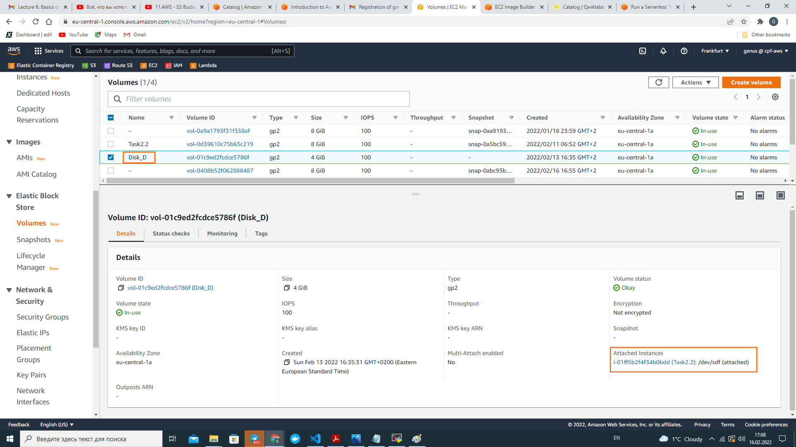
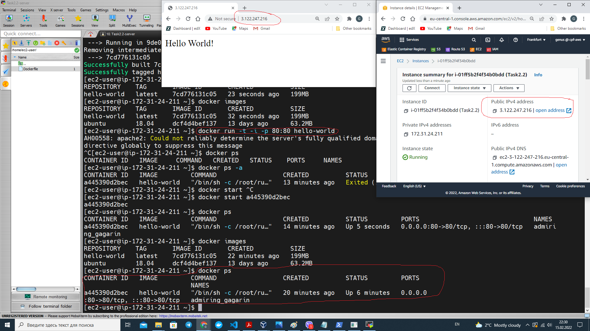

# Module 2. Virtualization and Cloud Basic

## TASK 2.2

### Launch an instance (AMI) and volumes (EC2) [4]


### Connect to remote instance from local PC through SSH (EC2, MobaXterm) [4]


### Create a snapshot of the instance (EC2) [5]


### Create and attach a Disk_D (EBS)

- create new volume and attach it to the instance


- create filesystem: `sudo mkfs -t ext4 /dev/sdf`

- create folder to which new volume shall be mounted: `sudo mkdir /mnt/disk_d`

- mount temporarily new volume to the folder: `sudo mount /dev/sdf /mnt/disk_d`

- mount permanently new volume adding line to /etc/fstab:
  `echo "/dev/sdf /mnt/disk_d ext4 defaults 0 0" | sudo tee -a /etc/fstab`

- check mounted disks/partitions: `df -h`

### Create and save some file on Disk_D.

```
touch /mnt/disk_d/hello.txt
echo "Hello world!" > /mnt/disk_d/hello.txt
cat /mnt/disk_d/hello.txt
```

### Launch the second instance from backup (EC2, EBS) [7]

#### Step 1. Create snapshot of instance


#### Step 2. Create 'My AMI' from snaphot


#### Step 3 Launch instance from 'My AMI'


### Detach Disk_D from the 1st instance and attach disk_D to the new instance (EBS) [8]

#### Original state: Disk_D is attached to 'Task2.2' instance



#### Step 1. Detach Disk_D from 'Task2.2' instance


#### Step 2. Disk_D is attached to another instance ('MyFirstInstance')


### Obtain a Elastic IP address (EC2) [9]


### Associate Elastic IP address with an instance (EC2) [9]


### Create custom domain name and join custom domain name with Elastic IP associated with the instance (Route 53) [9]


### Launch and configure a WordPress instance with Amazon Lightsail [10]


### Review the 10-minute Store and Retrieve a File (S3) [11]


### Upload files to the cloud to Amazon S3 using the AWS CLI (S3) [12]


### Run docker container in EC2 using Amazon ECS (EC2, ECS) [13]



### Test a serverless "Hello, World!" with AWS Lambda [14]


### Create a static website on Amazon S3, publicly available using a custom domain registered with Route 53 (S3, Route 53) [15]

[Link to static website on Amazon S3](http://gam-devops.link/)
