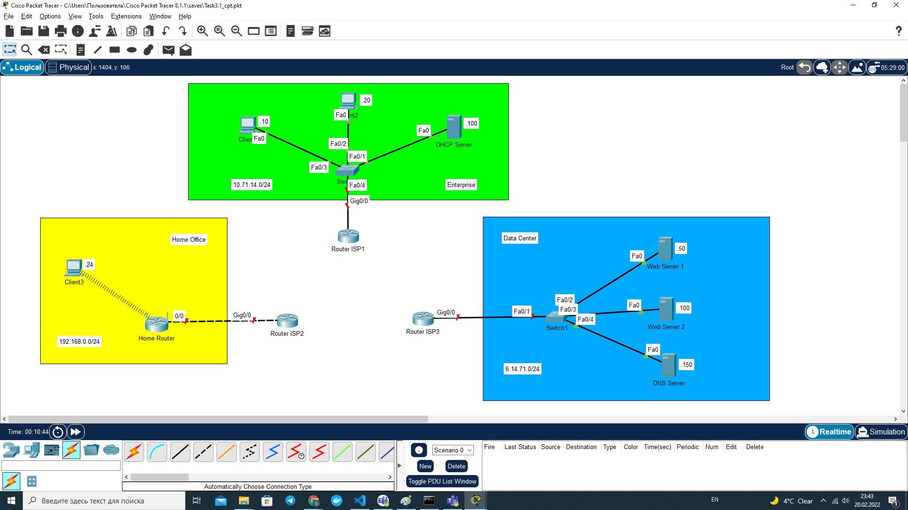
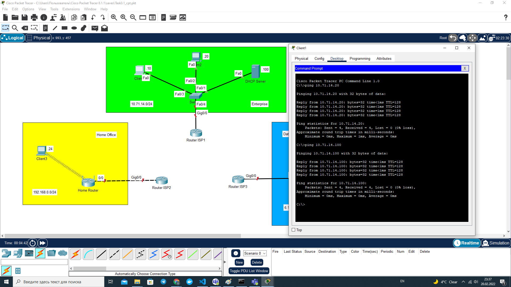
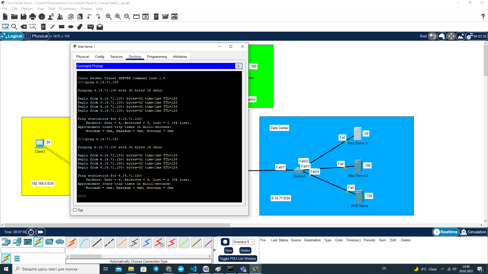
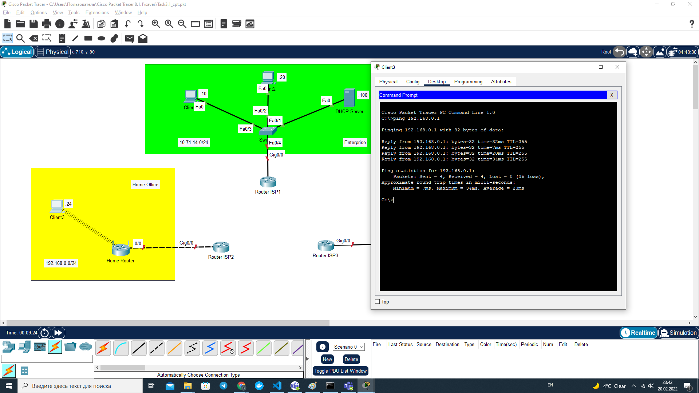
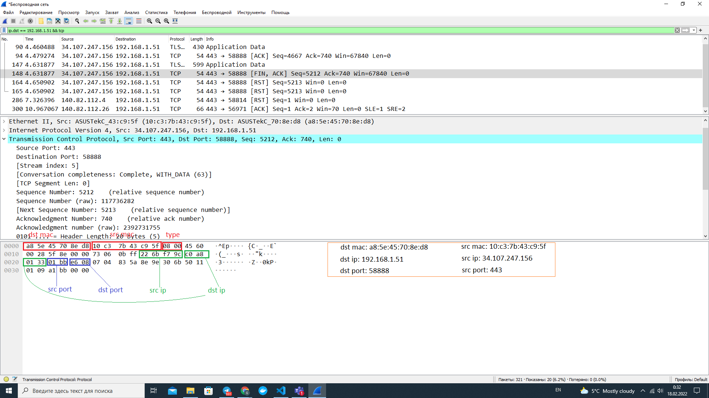

# Module 3. Networking Fundamentals

## TASK 3.1

### Establishing networks Home Office, Enterprise, Data Center

### Create Enterprise network (10.Y.D.0/24), set static address, check connection with `ping`

### Create Data Center network (M.D.Y.0/24), set static address, check connection with `ping`

### Create Home Office network (M.D.Y.0/24), change network adapter Ethernet to Wi-Fi adaptor (PT-HOST-NM-1W), set static address to client 3, check Client 3 -- Router connection with `ping 192.168.0.1`

### Reference to Cisco Packet Tracer file

[Task3.1_cpt.pkt](Task3.1_cpt.pkt)

### Additional task -- examine DPU structure with Wireshark

