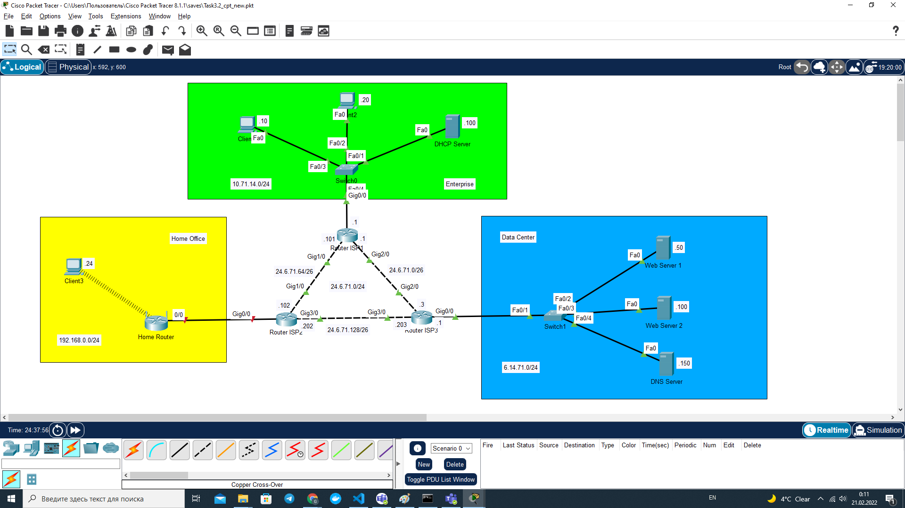
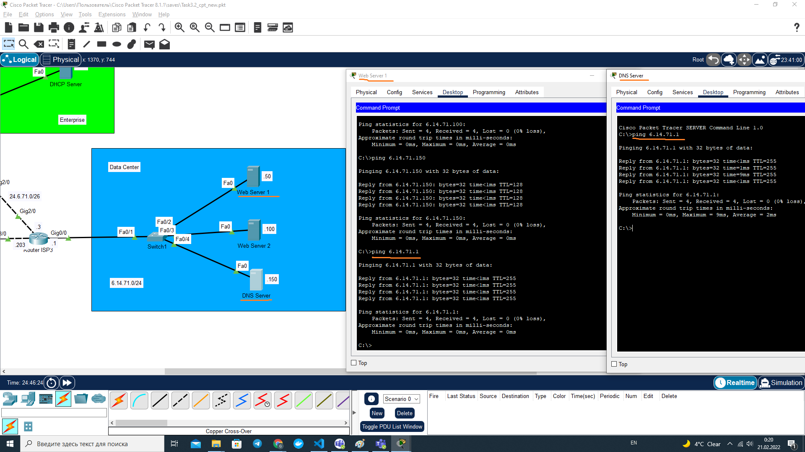
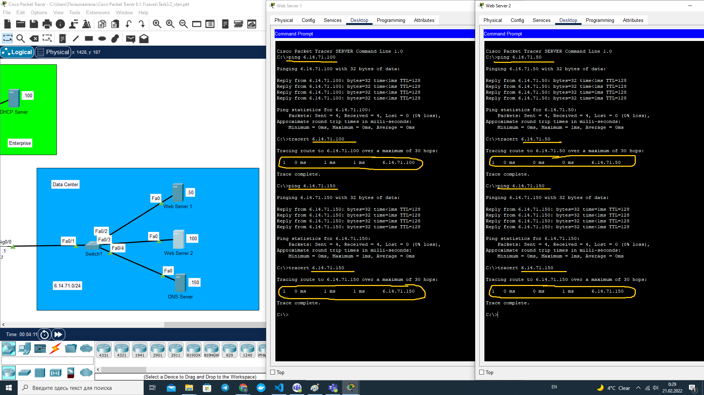
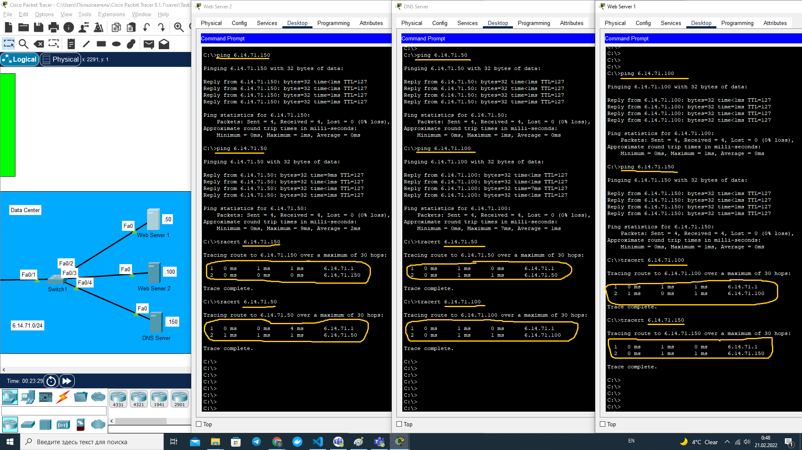
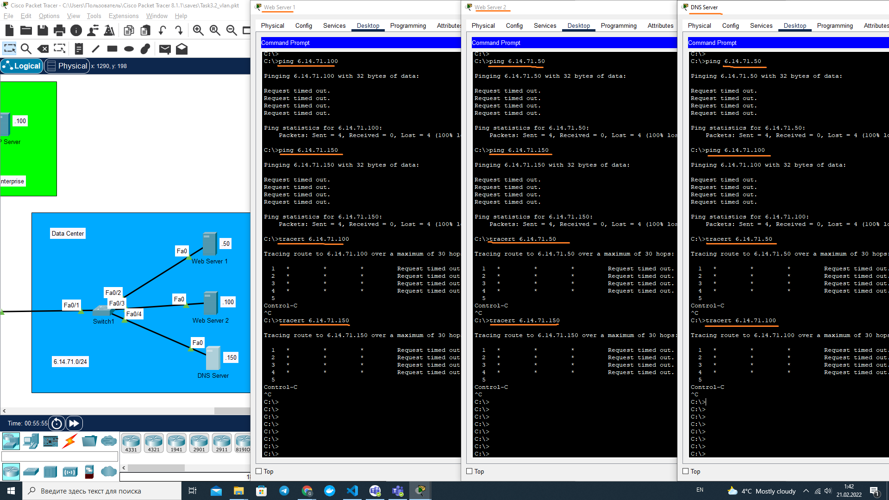
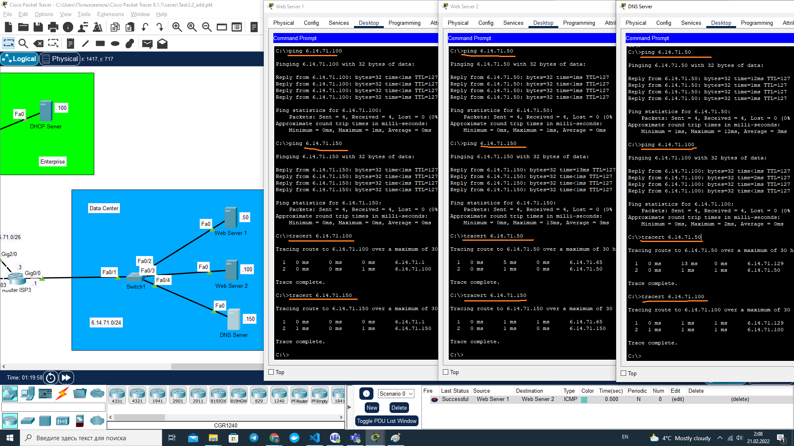

# Module 3. Networking Fundamentals

## TASK 3.2

### 1. Connect networks Home Office, Enterprise, and Data Center with 'Internet' network (D+10).M.Y.0/24

#### Set Default Gateway addresses. Check connection with `ping`

#### Reference to Cisco Packet Tracer file

[Task3.2_schema.pkt](Task3.2_schema.pkt)

### 2. Configure VLAN in Data Center network

#### Check inter-server connection with `ping`. Check frames routes with `tracert` -- Original check [6]

**Comment**: Pings between Data Center servers succesfully passed, as all three servers are in the same LAN and are able communicate directly through the Switch 1.

#### Check inter-server connection with `ping`. Check frames routes with `tracert` -- Second check after change of subnetwork mask to 255.255.255.192 on each of Web Server 1, Web Server 2 and DNS Server [8]

**Comment**: Because of the change of the subnetwork mask to 255.255.255.192, each server in Data Center appears in its own subnetwork. Thus, sending DPU to another server means sending it to a different network and the frames shall go now through the default gateway, which is Router ISP3 (6.14.71.1). The default gateway 'sees' all three subnetworks within Data Center, therefore it may forward frames directly to the destination IP address (through Switch 1). Results of `tracert` command and `ping` command (decremented TTL) shows +1 hop (default gateway) on the way between the source and the destination.

#### Change configuration of Switch Data Center. Add VLAN as follows: FE0/2 – VLAN2, FE0/3 – VLAN3, FE0/4 – VLAN4. Check again with `ping` and `tracert` [10]

**Comment**: Now each server in the Data Center appears in its own VLAN. Switch 1 gets the frame from the sending server and tries to forward it to other devices within the same LAN. Two other servers and Router ISP3 belong to different VLANs, thus frame cannot be delivered and is ignored.

#### Reference to Cisco Packet Tracer file

[Task3.2_vlan.pkt](Task3.2_vlan.pkt)

### 3. Additional task: trunk mode experiment with VLAN. Check again with `ping` and `tracert` [16]

**Comment**: Now, when Switch 1 interface FastEthernet 0/1 is switched from access to trunk mode and Router ISP3 subinterfaces correspond to 'default gateways' specified on the servers, frames are forwarded to the default gateway (Router ISP3) through the trunk interface, which can recognize destination IP address and direct the frames to the receiving server.

#### Reference to Cisco Packet Tracer file

[Task3.2_add.pkt](Task3.2_add.pkt)
