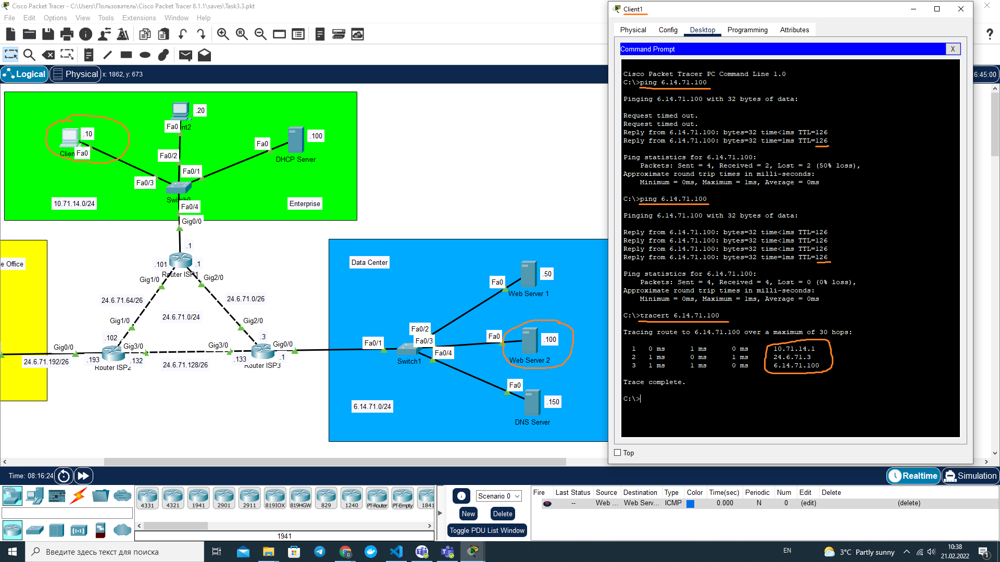
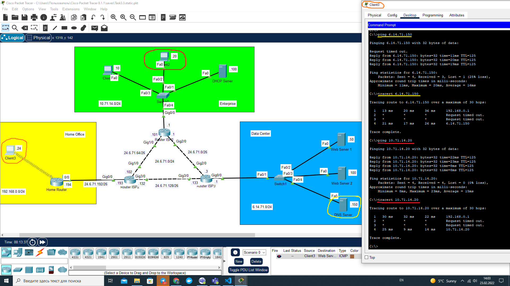

# Module 3. Networking Fundamentals

## TASK 3.3

### 1. Configuration of Static Routing. Check connection with `ping` and `tracert`

### 2. Configuration of wireless Home Router. Check connection with `ping` and `tracert`

#### Reference to Cisco Packet Tracer file (static routing)

[Task3.3.static.pkt](Task3.3.static.pkt)

### 3. Additional Task: Configuration of Dynamic Routing. Check connection with `ping` and `tracert`

#### Reference to Cisco Packet Tracer file (dynamic routing)

[Task3.3.dynamic.pkt](Task3.3.dynamic.pkt)
