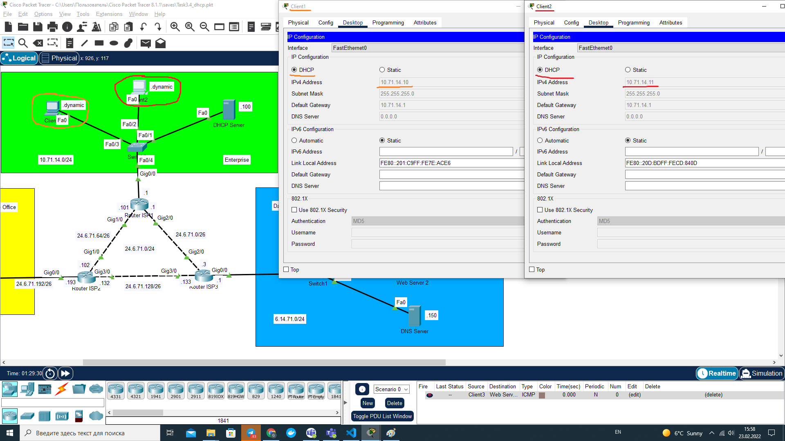
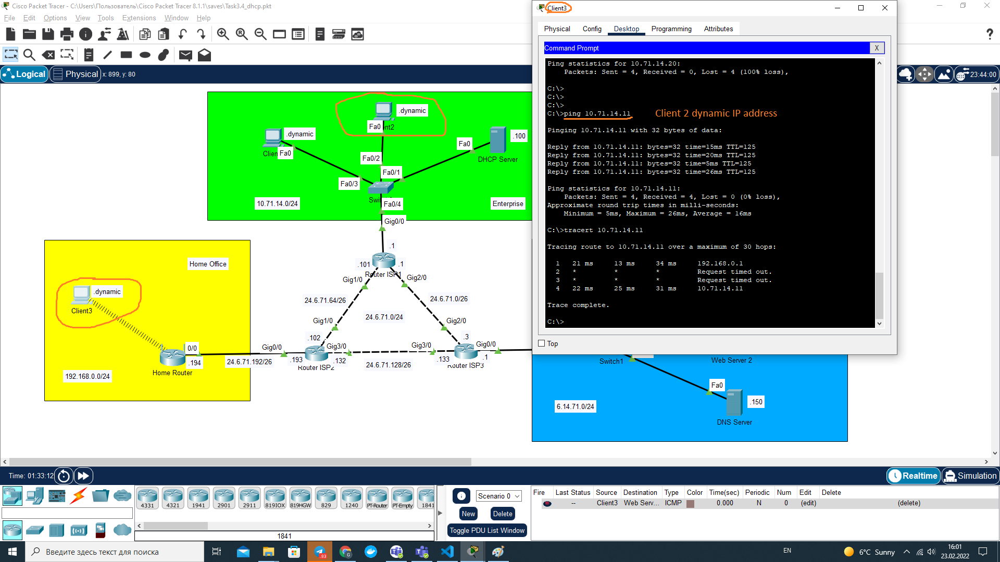
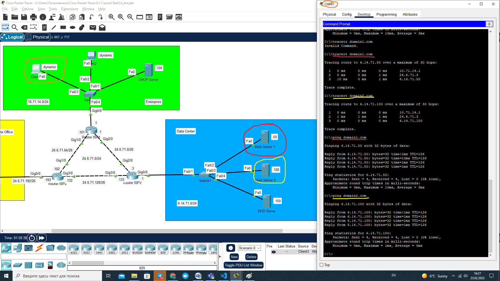
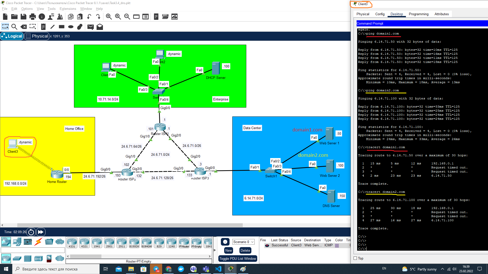

# Module 3. Networking Fundamentals

## TASK 3.4

### 1. DHCP Configuration [1 - 4]

#### Configuration of DHCP Server in Enterprice network. Check dynamic addresses on Client 1 and client 2

#### Configuration of DHCP on Home Router. Check dynamic address of Client 3

#### Check connection from Client 3 to Client 2 (dynamic address)

#### Reference to Cisco Packet Tracer file (DHCP)

[Task3.3.dynamic.pkt](Task3.4_dhcp.pkt)

### 2. DNS Configuration [5 - 8]

#### Configuration of DNS Server in Data Center

- Add DNS address to configurations of DHCP server. Check connection from Client 1 to Web Server 1 and Web Server 2 by domain name

- Add DNS address to DHCP configurations of Home Router. Check connection from Client 3 to Web Server 1 and Web Server 2 by domain name

#### Reference to Cisco Packet Tracer file (dynamic routing)

[Task3.4_dns.pkt](Task3.4_dns.pkt)

### 3. Additional Task: Configuration of Dynamic Routing. Check connection with `ping` and `tracert`
