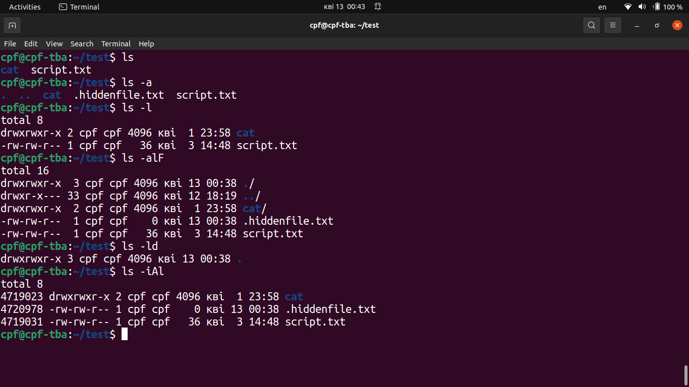

# Module 4. Linux Essentials

## TASK 4.1

### Task1. Part1

1. Log in to the system as root (or sudo-er).

Commands `sudo -i` and `sudo -s` allow the user with admin rights ('sudo' group) to run administrative commands:


To check the list of users beloning to 'sudo' group:

`getent group sudo | cut -d: -f1,4-`.


or alternatively:

`cat /etc/group | grep sudo`

To add user to 'sudo' group: `sudo usermod -a -G sudo <username>`

To activate (unlock) the root account and set password for 'root' user:

`sudo passwd root` - unlock root account, set password for root

To verify that the root password is set: `sudo cat /etc/shadow | grep root`)

To login as a root: `su -` and enter root password


To remove the password and lock the root account again:

`sudo passwd -dl root`

2. Use the passwd command to change the password. Examine the basic parameters
   of the command. What system file does it change?

Here is an example `passwd` command to change by user 'dev' of his own password:


Example of the change by sudoer 'cpf' of the password of the other user ('dev'): `sudo passwd dev`. Password change for user 'dev' is reflected in system file /etc/shadow containing users' hashed passwords:


| Basic parameters of `passwd` command: |                                                                    |
| :------------------------------------ | :----------------------------------------------------------------- |
| -a, --all                             | report password status on all accounts (to be used with -S option) |
| -d, --delete                          | delete the password for the named account                          |
| -e, --expire                          | force expire the password for the named account                    |
| -i, --inactive INACTIVE               | set password inactive after expiration to INACTIVE                 |
| -l, --lock                            | lock the password of the named account                             |
| -n, --mindays MIN_DAYS                | set minimum number of days before password change to MIN_DAYS      |
| -S, --status                          | report password status on the named account                        |
| -w, --warndays WARN_DAYS              | set expiration warning days to WARN_DAYS                           |
| -u, --unlock                          | unlock the password of the named account                           |
| -x, --maxdays MAX_DAYS                | set maximum number of days before password change to MAX_DAYS      |

3. Determine the users registered in the system, as well as what commands they
   execute. What additional information can be gleaned from the command execution?

The `w` command displays information about the users currently on the machine, and
their processes. The header shows, in this order, the current time, how
long the system has been running, how many users are currently logged
on, and the system load averages for the past 1, 5, and 15 minutes.

The following entries are displayed for each user:

- login name (USER),
- the tty name (TTY),
- the remote host (FROM),
- login time (LOGIN@),
- idle time (IDLE),
- JCPU (JCPU),
- PCPU (PCPU), and
- the command line of their current process (WHAT).

The JCPU time is the time used by all processes attached to the tty.

The PCPU time is the time used by the current process, named in the WHAT field.

Example of `w` command:


4. Change personal information about yourself.

To change personal information:

Command `chfn` - if used without options, changes are made in interactive mode.

To verify that changes are recorded:

`finger -lp [username]` (by defaulf shows information about the current user).

Example of above commands:


5. Become familiar with the Linux help system and the man and info commands.
   Get help on the previously discussed commands, define and describe any two keys for these commands. Give examples.

To get help commands examples:

```
chfn --help

info finger

man w
```

Examples of keys/options for the commands mentioned in items 1-4 above:
| Command | Option | Description |
| :------ | :----- | :-----------------------------------------|
| passwd | -d | delete the password for the named account |
| passwd | -S | report password status on the named account |
| w | -s | short format |
| w | -i | display IP address instead of hostname (if possible) |
| finger | -l | Produces a multi-line format displaying all of the information described for the -s option as well as the user's home directory, home phone number, login shell, mail status, and the contents of the files “.plan”, “.project”, “.pgpkey” and “.forward” from the user's home directory |
| finger | -p | Prevents the -l option of finger from displaying the contents of the “.plan”, “.project” and “.pgpkey” files. |
| chfn | -f FULL_NAME | change user's full name |
| chfn | -h HOME_PHONE| change user's home phone number |


6. Explore the more and less commands using the help system. View the contents of
   files .bash\* using commands.


7. Determine the last logon time for all users. Tip: You should read the
   documentation for the finger command.

`finger -s $(cat /etc/passwd | grep -wP "x:\d{4}" | cut -d : -f 1)`


8. List the contents of the home directory using the ls command, define its files
   and directories. Hint: Use the help system to familiarize yourself with the ls
   command.

Example of `ls -alF` command (directories may be recognized: by letter "d" at the beginning of the line, by colored name of directory, and by "/" symbol at the end of the line):


### Task1. Part2

1. Examine the tree command. Master the technique of applying a template, for
   example, display all files that contain a character c, or files that contain a specific
   sequence of characters. List subdirectories of the root directory up to and including
   the second nesting level.

`tree -P "*ssh*"` - to display all files that contain 'ssh' sequence of characters.

`tree -L 2 /` - to list subdirectories of the root directory up to and including
the second nesting level.


2. What command can be used to determine the type of file (for example, text or
   binary)? Give an example.

`file` command determines the file type. The "file" command tests each argument in an attempt to classify it.

Examples:


3. Master the skills of navigating the file system using relative and absolute paths.
   How can you go back to your home directory from anywhere in the filesystem?

To check current directory (get absolute path): `pwd` command.

To change directory: `cd <path>`, example: `cd /media/cpf`

To go back to the previous directory: `cd -`

To go one directory up: `cd ..`

To go to home directory from anywhere: `cd ~`

To add directory to stack: `pushd <directoryname>`

To remove directory from stack: `popd`


4. Become familiar with the various options for the ls command. Give examples of
   listing directories using different keys. Explain the information displayed on the
   terminal using the -l and -a switches.

The `ls` command lists information about the files (the current directory by default).

`ls -a` - list all files and directories, including 'hidden' (starting with '.').

`ls -l` - list all files and directories in a long listing format.

`ls -d` - list directories themselves, not their contents.

`ls -i` - print the index number of each file (inode).

`ls -F` - append indicator of directory '/' to entries.

`ls -lR` - recursive long listing.

`ls -lh` - human readable file sizes.

`ls -lS` - sort files by size.

`ls -lt` - sort files by modification time.

`ls -ltu` - sort by, and show, access time.



5. Perform the following sequence of operations:

- create a subdirectory in the home directory;

  `mkdir subdir`

- in this subdirectory create a file containing information about directories located in
  the root directory (using I/O redirection operations);

  `ls -l / > inforootdir.txt`

- view the created file;

  `cat subdir/inforootdir.txt` (more, less, head, tail may be used instead of cat)

- copy the created file to your home directory using relative and absolute addressing.

  `cp subdir/inforootdir.txt ~/`

- delete the previously created subdirectory with the file requesting removal;

  `rm -r subdir`

- delete the file copied to the home directory.

  `rm inforootdir.txt`


6. Perform the following sequence of operations:

- create a subdirectory test in the home directory;

  `mkdir test`

- copy the .bash_history file to this directory while changing its name to
  labwork2;

  `cp .bash_history test/labwork2`

- create a hard and soft link to the labwork2 file in the test subdirectory;

  `cd test`

  `ln labwork2 hard_link_to_labwork2`

  `ln -s labwork2 soft_link_to_labwork2`

- how to define soft and hard link, what do these concepts;

**Hard link** is just another name for the original file. This name is written in the inode of the source file. Once a hard link is created, it is impossible to distinguish between the original file name and the hardlink to that file. If either original file name or hardlink to that file is deleted, the file itself remains saved on disk so long as it has at least one reference thereto (original file name or any hardlink to that file).

**Soft link** or **Symbolic link** can also be treated as additional filenames, but it is a separate file (with its own inode) known as symbolic link. Unlike hard link, the symbolic link can point to a file located in different filesystem, such as a mountable medium or another computer. If the original file is deleted/unmounted, the symbolic link is not removed despite that original file becomes unavailable.

- change the data by opening a symbolic link. What changes will happen and why

By opening a symbolic link we can change (add, edit, delete) any data in the file as if it is opened through the original filename (all changed are reflected in the original file).

- rename the hard link file to hard_lnk_labwork2;

  `mv hard_link_to_labwork2 hard_lnk_labwork2`

- rename the soft link file to symb_lnk_labwork2 file;

  `mv soft_link_to_labwork2 symb_lnk_labwork2`

- then delete the labwork2. What changes have occurred and why?

  `rm labwork2`

In below screenshot 'labwork2' and 'hard_lnk_labwork2' have the same inode 4849666. Deletion of 'labwork2' has no affect on 'hard_lnk_labwork2' which has reference to the inode 4849666 (in fact, inode and original file remain, only original reference to this file/filename is deleted).

The 'symb_lnk_labwork2' file (having inode 4849667) was not deleted with deletion of the original file, however, its reference to the original file does not work anymore. The file cannot be opened or changed through the symbolic link (which is reflected by change the link font color to red).


7. Using the locate utility, find all files that contain the squid and traceroute
   sequence.

Command `locate` finds files by name. By default `locate` does search in own database mlocate.db. To update this database: `sudo updatedb` command.

`locate -A [pattern_1] ... [pattern_N]` finds only files satisfying all patterns

Option '-b' - finds only among filenames, ignoring full path (directories names).
Option '-i' - ignore case distinctions when matching patterns.
Options '-l LIMIT', '-n LIMIT' - exit succesfully after finding LIMIT entries.
Option '-c' - instead of writing file names counts the number of entries.
Option '-e' - print only entries that refer to files existing at the time locate is run.

Examples:

`locate -Ab squid traceroute`

`locate squid`

`locate -b traceroute`


8. Determine which partitions are mounted in the system, as well as the types of
   these partitions.

`df -aTh`

Command `df [OPTION] [FILE]` shows information about the file system on which each FILE resides,
or all file systems by default.

Options:

-a, --all include pseudo, duplicate, inaccessible file systems

-T, --print-type print file system type

-h, --human-readable print sizes in powers of 1024 (e.g., 1023M)

-x, --exclude-type=TYPE limit listing to file systems not of TYPE


9. Count the number of lines containing a given sequence of characters in a given
   file.

`grep -c "ls" ~/.bash_history`

`grep ls ~/.bash_history | wc -l`


10. Using the find command, find all files in the /etc directory containing the host
    character sequence.

`sudo find /etc -name "*host*"`


11. List all objects in /etc that contain the ss character sequence. How can I duplicate
    a similar command using a bunch of grep?

`sudo find /etc -name "*ss*"` - finds ss character sequence in files' names

`sudo find /etc | grep "ss"` - finds ss character sequence both in files' names and in paths


12. Organize a screen-by-screen print of the contents of the /etc directory. Hint: You
    must use stream redirection operations.

`ls -alF /etc | less`


13. What are the types of devices and how to determine the type of device? Give
    examples.

Devices (physical and virtual) are shown in /dev directory, for example:

/dev/sda (First SCSI disk whole disk),

/dev/srO (SCSI CD ROM with the lowest SCSI ID),

/dev/ttyS0 (Serial port 0, COM1 under MS DOS),

/dev/usb/ (USB devices),

/dev/fd/ (Floppy drive),

/dev/mouse (Symbolic link to the mouse device file)

The type of device can be checked on https://www.kernel.org/doc/html/latest/admin-guide/devices.html. For more specific information about devices use commands `mount`, `sudo fdisk -l`, `dmidecode`, `lsblk`, `lshw`, etc or utilities like `hwinfo`.

14. How to determine the type of file in the system, what types of files are there?

Command `file [OPTION] [FILE]` determines the type of FILE.

For example, to determine types of files in the current directory: `file ./*` or `file *`:


**Types of files:**

- Regular Files ("-")

Regular files are ordinary files on a system that contains programs, texts, or data. It is used to store information such as text, or images. Command to create regular file: `touch`.

- Directory Files ("d")

Thedirectory files store the other regular files, directory files, and special files and their related information. A directory file contains an entry for every file and sub-directory that it houses. Command to create directory file: `mkdir`.

- Block Files ("b")

Block files act as a direct interface to block devices. A block device is any device that performs data Input and Output operations in units of blocks. These files are hardware files and most of them are present in /dev. Command to create block file: `fdisk`.

- Character device files ("c")

A character file is a hardware file that reads/writes data in character by character in a file. These files provide a serial stream of input or output and provide direct access to hardware devices. The terminal, serial ports, etc are examples of this type of file. Command to create character file: `mknod`.

- Pipe Files ("p"):

The other name of pipe is a “named” pipe, which is sometimes called a FIFO (“First In, First Out”). The “name” of a named pipe is actually a file name within the file system. This file sends data from one process to another so that the receiving process reads the data first-in-first-out manner. Command to create pipe: `mkfifo`.

- Symbol link files ("l"):

A symbol link file is a type of file which points to another file or a folder on device. Symbol link files are similar to shortcuts in Windows. Command to create symbol link file: `ln -s`.

- Socket Files ("s"):

A socket is a special file that is used to pass information between applications and enables the communication between two processes. We can create a socket file using the socket() system call. A socket file is located in /dev of the root folder. Command to find socket files: `find / -type s`.

15. List the first 5 directory files that were recently accessed in the /etc directory.

`ls -ltu /etc | grep ^d | head -5`


