# Module 4. Linux Essentials

## TASK 4.2

### Part 1

1. Analyze the structure of the '/etc/passwd' and '/etc/group' file, what fields are
   present in it, what users exist on the system? Specify several pseudo-users, how to
   define them?

The '/etc/passwd' and '/etc/group' are files which contain users and groups records respectively in a colon-separated format as follows:

| /etc/passwd                             | /etc/group                                                          |
| :-------------------------------------- | :------------------------------------------------------------------ |
| User name                               | Group name                                                          |
| Encrypted user password or 'x' [Note 1] | Encrypted group password or 'x'                                     |
| User ID number (UID)                    | Group ID number (GID)                                               |
| User's group ID number (GID)            | Comma-separated list of the usernames that are members of the group |
| Full name of the user (GECOS) [Note 2]  |                                                                     |
| User home directory                     |                                                                     |
| Login shell                             |                                                                     |

Note 1: Usually 'x' as the encrypted passwords are kept in a separate file '/etc/shadow' (for users) or '/etc/gshadow' (for groups) for security purposes. "!" means that password was not set.

Note 2: The comment field. It allows to add extra information about the user such as user’s full name, phone number etc. This field is used by finger command.

Example of /etc/passwd content:

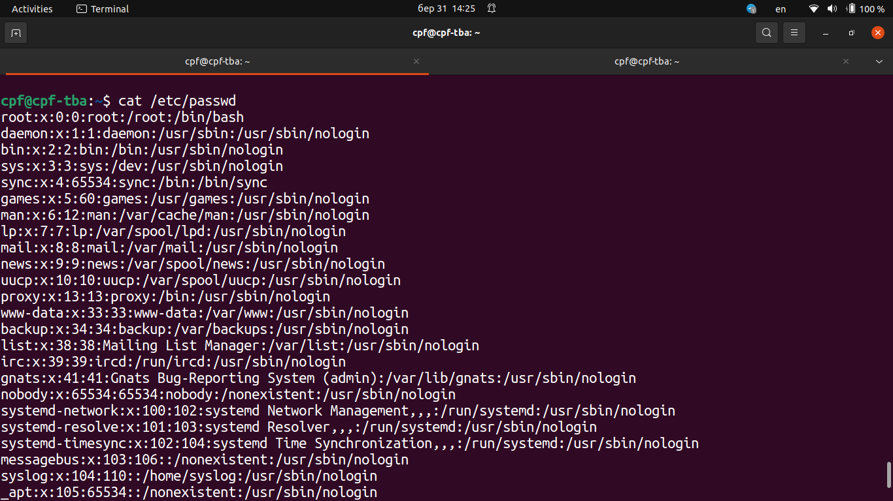

Example of /etc/group content:

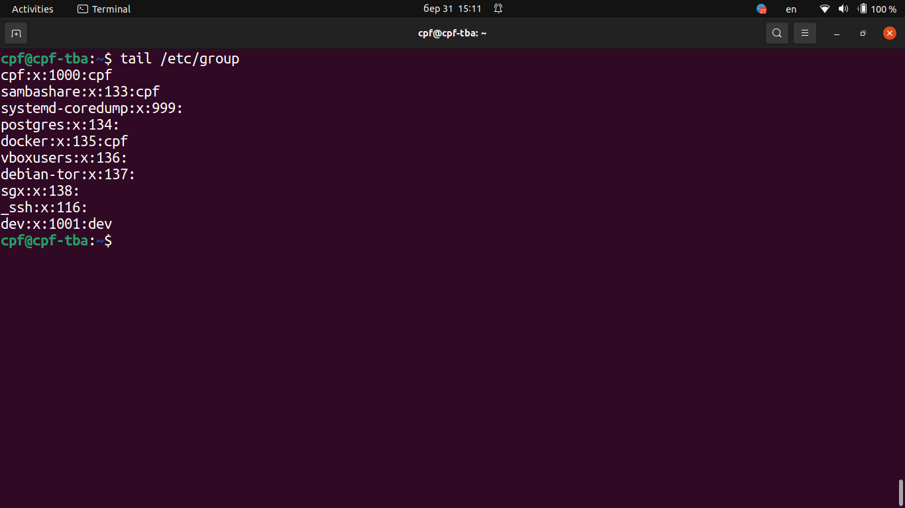

Example of /etc/shadow content:

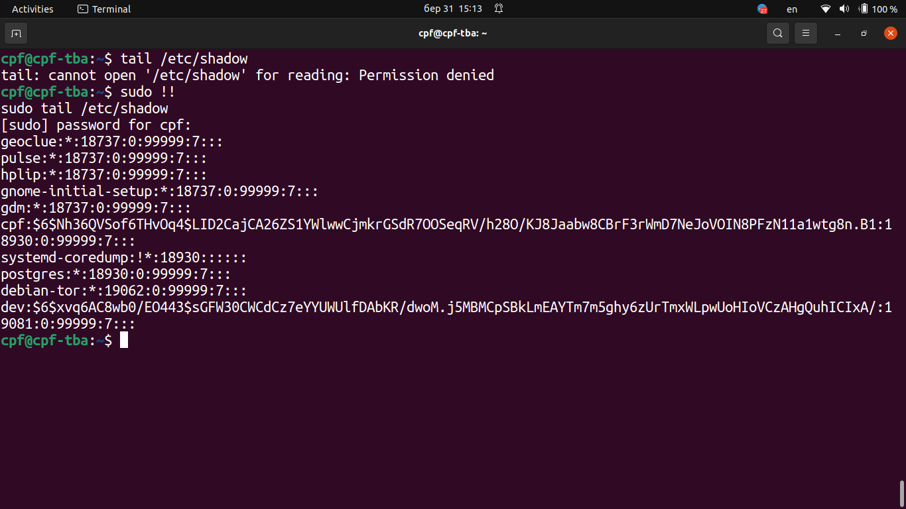

Shadow password protection:

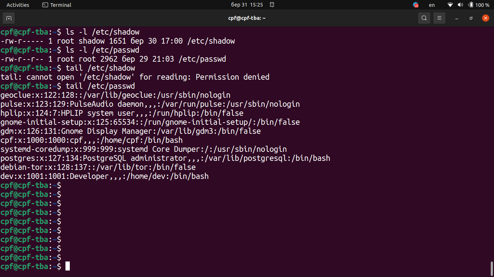

Pseudo-users are users with UID < 100. Pseudo-users example:

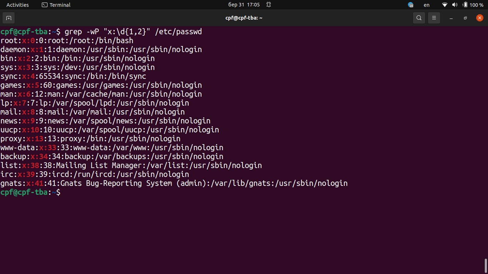

2. What are the uid ranges? What is UID? How to define it?

Linux operating systems identify a user by a value called a user identifier, abbreviated to user ID or UID. The UID is used to determine which system resources (files, processes) a user can access. The password file (/etc/passwd) maps textual user names to UIDs. The command-line command `id` gives the current user's UID, as well as more information such as the user name, primary user group, other user's groups and group identifiers (GID).

To see the other user ID: `id <username>`. User ID ranges: 0 - 65535 (2^16).

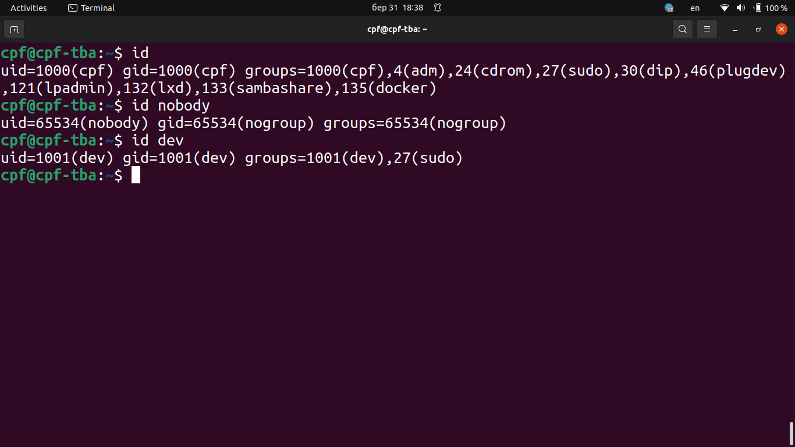

3. What is GID? How to define it?

Groups in Linux are defined by GIDs (group IDs). Just like with UIDs, the first 100 GIDs are usually reserved for system use. GID also allows to determine which system resources (files, processes) are available to the members of the group. GIDs are stored in the '/etc/group' file. This file shows all groups and their respective members.

4. How to determine belonging of user to the specific group?

To see the list of groups to which the current user belongs: `groups` or `id -Gn`, to see correponding GIDs: `id -G`. While command `groups <username1> <username2> ...` allows to see groups for each of the selected users, `id -G <username1> <username2> ...` allows to see respective GIDs.

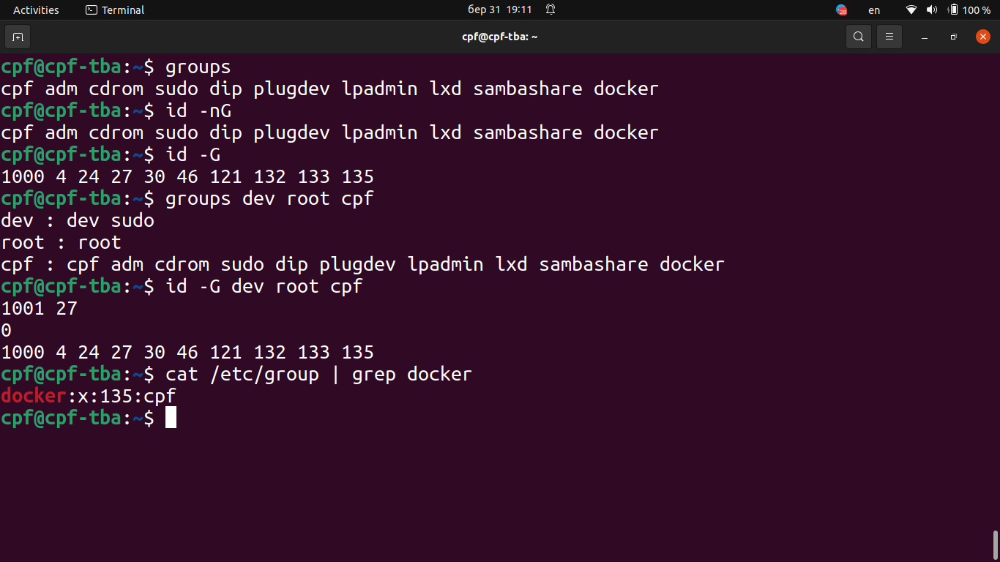

5. What are the commands for adding a user to the system? What are the basic
   parameters required to create a user?

A new user can be added with commands: `useradd` or `adduser`.

**Command `useradd` creates a new user or update new user information**

Example: `sudo useradd [options] <loginname>`.

The basic options which apply to the useradd command are:

-c, --comment COMMENT: A short description of the user, which is currently used as the field for the user's full name.

-d, --home-dir HOME_DIR: The new user's login directory

-e, --expiredate EXPIRE_DATE: The date on which the user account will be disabled.

-f, --inactive INACTIVE: The number of days after a password expires until the account is permanently disabled.

-g, --gid GROUP: The group name or number of the user's initial login group. The group name must exist. A group number must refer
to an already existing group.

-k, --skel SKEL_DIR: The skeleton directory, which contains files and directories to be copied in the user's home directory, when the
home directory is created by useradd. This option is only valid if the -m (or --create-home) option is specified.
If this option is not set, the skeleton directory is defined by the SKEL variable in '/etc/default/useradd' or, by
default, '/etc/skel'.

-m, --create-home: Create the user's home directory if it does not exist. The files and directories contained in the skeleton
directory (which can be defined with the -k option) will be copied to the home directory.

-s, --shell SHELL: The name of the user's login shell. The default is to leave this field blank, which causes the system to select
the default login shell specified by the SHELL variable in '/etc/default/useradd', or an empty string by default.

-u, --uid UID: The numerical value of the user's ID. This value must be unique, unless the -o option is used. The value must be
non-negative. The default is to use the smallest ID value greater than or equal to UID_MIN and greater than
every other user.

**Command `adduser` adds a user to the system interactively**

`adduser [options] [--home DIR] [--shell SHELL] [--no-create-home] [--uid ID] [--firstuid ID] [--lastuid ID] [--ingroup GROUP | --gid ID] [--disabled-password] [--disabled-login] [--gecos GECOS] [--add_extra_groups] [--encrypt-home] <user>`

If called with one non-option argument and without the '--system' or '--group' options, adduser will add a normal user. Command `adduser` will choose the first available UID from the range specified for normal users in the configuration file. The UID can be overridden with the '--uid' option. By default, each user is given a corresponding group with the same name.

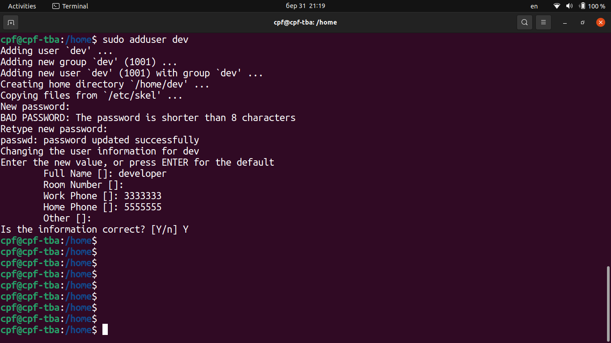

6. How do I change the name (account name) of an existing user?

Change the username and the home folder to the new name:

`sudo usermod -l <newname> -d /home/<newname> -m <oldname>`

Option '-l', '--login' NEW_LOGIN: The name of the user will be changed from LOGIN to NEW_LOGIN. Nothing else is changed. In particular, the user's home directory or mail spool should probably be renamed manually to reflect the new login name.

Change the user's group name to the new name:

`groupmod -n <newgroup> <oldgroup>`

Option '-n', '--new-name' NEW_GROUP: The name of the group will be changed from GROUP to NEW_GROUP name.

To verify the changes:

`id <newname>`

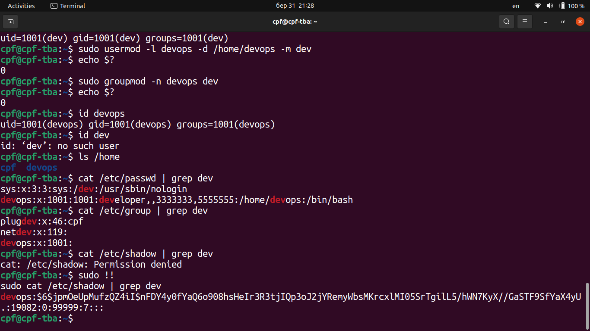

7. What is skell_dir? What is its structure?

Directory '/etc/skel/' (skel is derived from the “skeleton”) is used to initiate home directory when a user is first created.
A sample layout of “skeleton” user files is as follows:

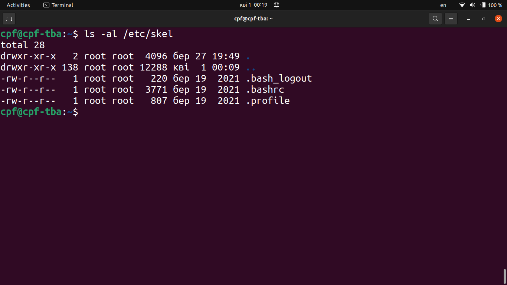

8.  How to remove a user from the system (including his mailbox)?

Command `userdel -r <username>` removes user from the system and all files along with the home directory itself and the user’s mailbox.

9.  What commands and keys should be used to lock and unlock a user account?

Method 1: Lock and unlock a user with passwd command

To lock: `passwd -l <username>`

To unlock: `passwd -u <username>`

To verify status: `passwd -S <username>`

Method 2: Lock and unlock users with usermod command

To lock the user: `usermod -L <username>`

To unlock the user: `usermod -U <username>`

Alternatively we can lock the user providing an expired date in the past: `usermod -L --expiredate 1970-01-02 <username>`.
To reverse this action: `usermod -U --expiredate '' <username>`

10. How to remove a user's password and provide him with a password-free login
    for subsequent password change?

Delete user's password (make it empty):

`passwd -d <username>`

Expire accounts's password and force the user to change his/her password at the user's next login:

`passwd -e <username>`

11. Display the extended format of information about the directory, tell about the
    information columns displayed on the terminal.

Below picture shows extended format of information about the directory and explains the columns information.

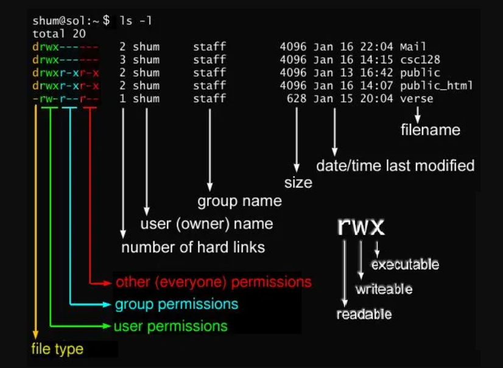

12. What access rights exist and for whom (i.e., describe the main roles)? Briefly
    describe the acronym for access rights.

```
drwxr-xr-x 1 root root     512 Oct 21 12:18 __pycache__
```

**Permissions summary**:

- owner (root) has permissions to read (r), write (w), execute(x)
- group (any member of root group) has permissions to read (r), execute(x)
- any other user has permissions to read (r), execute(x)

13. What is the sequence of defining the relationship between the file and the user?

The sequence defining the relationship between the file and the user may be seen with command:
`ls -l`, `ls -al` or `ls -ld` (for directories).
Example of such sequense:

```
 -rwxrwxrwx 1 root root 18 Feb 24 20:47 .gitignore
```

Below picture shows the labels of each column. Each sequence consists, among others, of file’s mode (which contains permissions), owner, group, and filename.

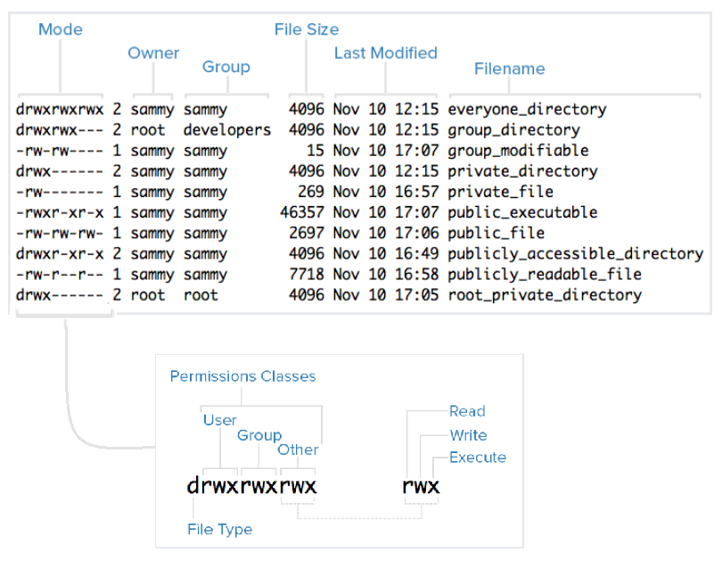

14. What commands are used to change the owner of a file (directory), as well as
    the mode of access to the file? Give examples, demonstrate on the terminal.

Command `chown` changes file's/directory's owner and/or group

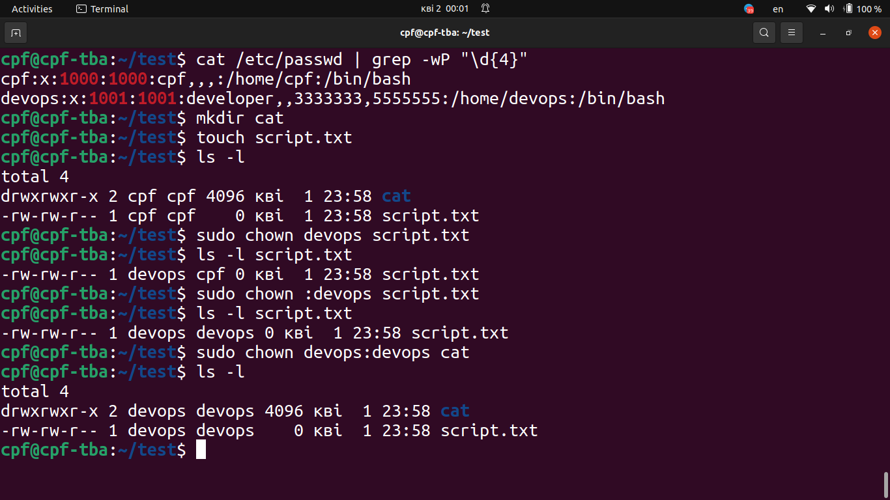

Command `chmod` changes file's/directory's permissions

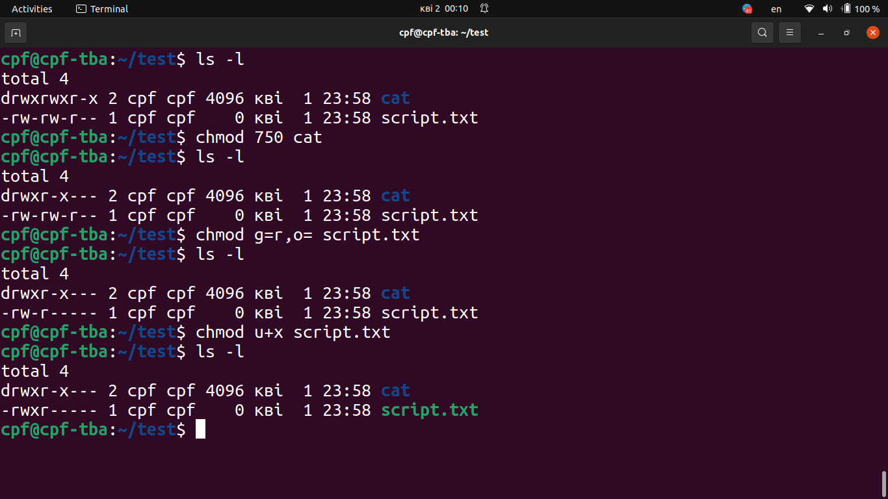

15. What is an example of octal representation of access rights? Describe the
    umask command.

Table of octal representation of access rights:

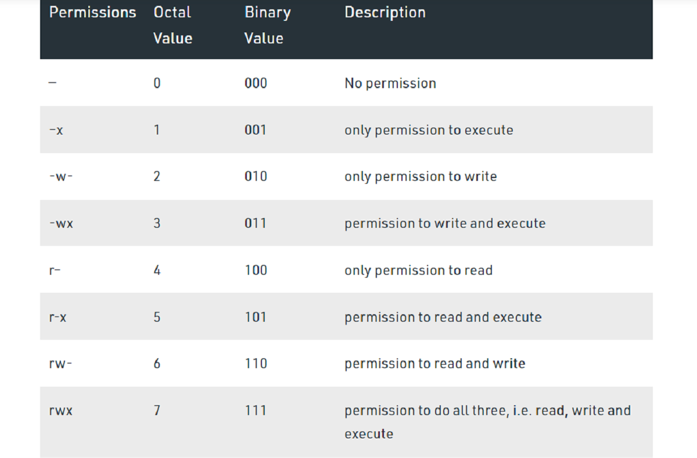

`umask` command is used to set default permissions for files and directories when they are created. Default value of `umask` is 0002.
It should be noted that the default permissions for files and directories are different as files do not provide the option to execute by default.

Lets assume that umask is set to 026. When a new directory is created, the permission will be calculated as (full permissions for directory) – (umask value) i.e. 777 – 026 = 751. In other words, the directory permissions will be 'd rwx r-x --x'.

When a new file is created, the permission will be given as follows: (full permissions for file) – (umask value) i.e. 666-026 = 640. In other words, the file permissions will be '- rw- r-- ---'.

16. Give definitions of sticky bits and mechanism of identifier substitution. Give
    an example of files and directories with these attributes.

A Sticky bit is a permission bit that is set on a file or a directory that lets only the owner of the file/directory or the root user to delete or rename the file. No other user is given privileges to delete the file created by some other user. Sticky bit is set by `chmod +t <filename or directoryname>`

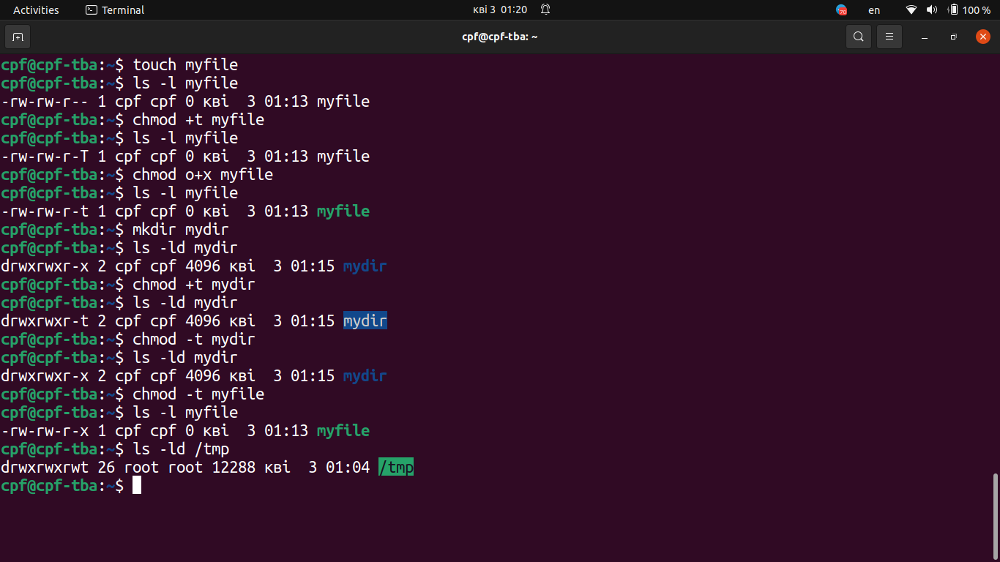

17. What file attributes should be present in the command script?

In Linux, there are three main file attributes: read (r), write (w), execute (x). Execute (x) allows a command script to be executed by users or the operating system. To make file executable: `chmod a+x <filename>`. To launch in the command line: `./<filename>`. The command script itself may start from #! (sha-bang) in order to specify which interpreter shall be run for execution, for example: '#!/bin/bash'.
