# Module 4. Linux Essentials

## TASK 4.3

### Part 1

1. How many states could have a process in Linux?

| State                     | Discription                                                                                                      |
| :------------------------ | :--------------------------------------------------------------------------------------------------------------- |
| R - running               | The process is currently active and using CPU time or in the queue of runnable processes waiting to get services |
| D - uninterruptible sleep | The process is in a sleep state that cannot be stopped. This ussually happens while a process is waiting for I/O |
| S - sleeping              | The process is waiting for an event to complete                                                                  |
| T - stopped               | The process has been stopped, which tipically has happened to an interactive shell process, using ^Z combination |
| Z - zombie                | The process has been stopped but cannot be removed by its parent, which has put it in an unmanageble state       |

2. Examine the pstree command. Make output (highlight) the chain (ancestors) of the current
   process.

Command `pstree` with options '-H' or '-h' displays a tree of processes and highlights the current process and its ancestors:

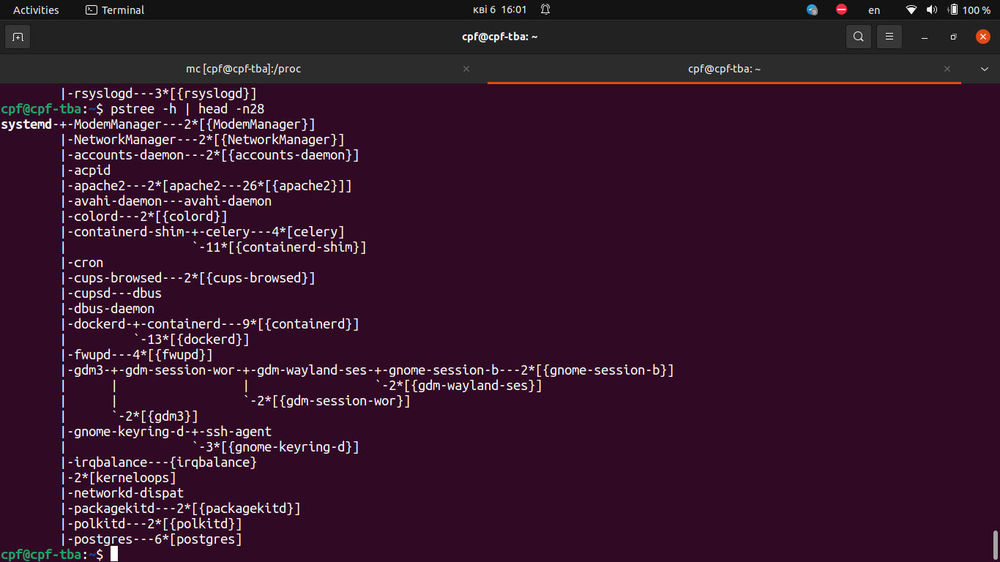

Other useful options (-p, -T, -s):

`pstree -p <username>` - shows PID for processes filtered by username.

`pstree -T <username>` - hides the threads for processes filtered by username.

`pstree -s <PID>` - shows the process relationship with its ancestors.

3. What is a proc file system?

Proc file system ('procfs') is virtual file system created on fly when system boots and is dissolved at the time of system shut down.
It contains useful information about the processes that are currently running, it is regarded as control and information center for kernel.
The proc file system also provides communication medium between kernel space and user space.
In linux '/proc' includes a directory for each running process, including kernel processes, and directories named '/proc/PID' may contain:

| directory         | description                                     |
| :---------------- | :---------------------------------------------- |
| /proc/PID/cmdline | Command line arguments.                         |
| /proc/PID/cpu     | Current and last cpu in which it was executed.  |
| /proc/PID/cwd     | Link to the current working directory.          |
| /proc/PID/environ | Values of environment variables.                |
| /proc/PID/exe     | Link to the executable of this process.         |
| /proc/PID/fd      | Directory, which contains all file descriptors. |
| /proc/PID/maps    | Memory maps to executables and library files.   |
| /proc/PID/mem     | Memory held by this process.                    |
| /proc/PID/root    | Link to the root directory of this process.     |
| /proc/PID/stat    | Process status.                                 |
| /proc/PID/statm   | Process memory status information.              |
| /proc/PID/status  | Process status in human readable form.          |

Some other files in '/proc' filesystem may be:

| file              | description                                                                                                  |
| :---------------- | :----------------------------------------------------------------------------------------------------------- |
| /proc/crypto      | list of available cryptographic modules                                                                      |
| /proc/diskstats   | information (including device numbers) for each of the logical disk devices                                  |
| /proc/filesystems | list of the file systems supported by the kernel at the time of listing                                      |
| /proc/kmsg        | holding messages output by the kernel                                                                        |
| /proc/meminfo     | summary of how the kernel is managing its memory.                                                            |
| /proc/scsi        | information about any devices connected via a SCSI or RAID controller                                        |
| /proc/tty         | information about the current terminals                                                                      |
| /proc/version     | containing the Linux kernel version, distribution number, gcc version number (used to build the kernel) etc. |

4. Print information about the processor (its type, supported technologies, etc.).

`grep "cpu" /proc/cpuinfo`

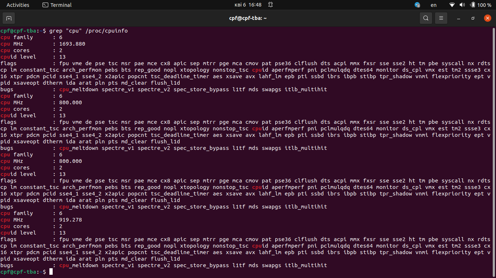

Alternatively: `lscpu`

5. Use the ps command to get information about the process. The information should be as
   follows: the owner of the process, the arguments with which the process was launched for
   execution, the group owner of this process, etc.

`ps -eo pid,%cpu,%mem,state,lstart,user,egroup,args`

-e Select all processes.

-o Specify user-defined format.

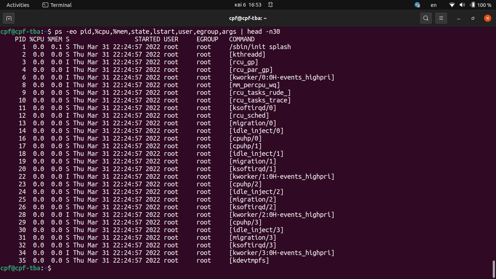

| Attribute  | Header  | Comment                                                                                                              |
| :--------- | :------ | :------------------------------------------------------------------------------------------------------------------- |
| pid        | PID     | a number representing the process ID.                                                                                |
| %cpu       | %CPU    | cpu utilization of the process.                                                                                      |
| %mem       | %MEM    | ratio of the process to the physical memory on the machine, in percentage.                                           |
| state      | S       | minimal state display (one character).                                                                               |
| start_time | START   | starting time or date of the process.                                                                                |
| time       | TIME    | cumulative CPU time.                                                                                                 |
| euser      | EUSER   | effective user name. This will be the textual user ID, if it can be obtained and the field width permits.            |
| egroup     | EGROUP  | effective group ID of the process. This will be the textual group ID, if it can be obtained the field width permits. |
| args       | COMMAND | command with all its arguments as a string.                                                                          |

6. How to define kernel processes and user processes?

Kernel processes may be recognized by the command name in the square brackets.
Thus, we can filter them out from the general list of all processes with grep command:

`ps aux | grep -e "\[.*]"`

For the other (users') processes we can apply apply flag -v (invert match in grep command):

`ps aux | grep -v -e "\[.*]"`

7. Print the list of processes to the terminal. Briefly describe the statuses of the processes.What condition are they in, or can they be arriving in?

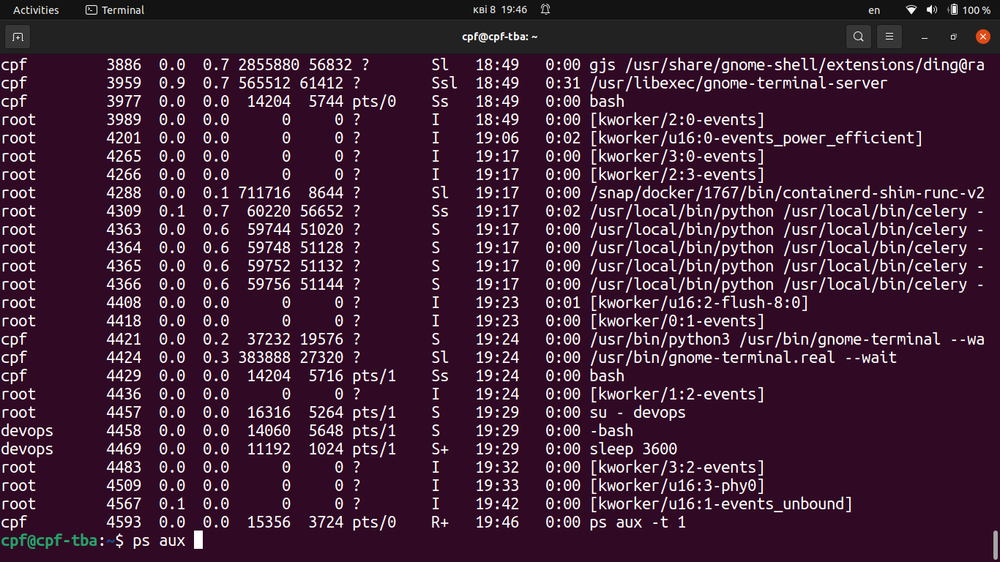

Process statuses from the listing:

Sl - 'S' interruptible sleep, 'l'multi-threaded (using CLONE_THREAD)

Ssl - 'S' interruptible sleep, 's' is a session leader, 'l'multi-threaded

I - 'I' Idle kernel thread

Ss - 'S' interruptible sleep (waiting for an event to complete), 's' is a session leader

S+ - 'S' interruptible sleep and '+' means: in the foreground process group

R+ - 'R' running or runnable (on run queue) and '+' means: in the foreground process group

8. Display only the processes of a specific user.

`ps -u <username>`

9. What utilities can be used to analyze existing running tasks (by analyzing the help for the ps
   command)?

The `top` and `htop` commands are used to display all the running and active real-time processes in an ordered list and updates it regularly.

The `lsof` command is used to display a list of all the open files and the processes. The open files included are disk files, network sockets, pipes, devices, and processes.

The `netstat` is a command-line tool for monitoring incoming and outgoing network packets statistics as well as interface statistics.

10. What information does top command display?

The top program provides a dynamic real-time view of a running system. It can display system summary information as well as a list of processes or threads currently being managed by the Linux kernel.

When started for the first time, you'll be presented with these traditional elements on the main top screen:

1.  Summary Area;
2.  Fields/Columns Header;
3.  Input/Message line between the Summary Area and Columns Header.
4.  Task Area.

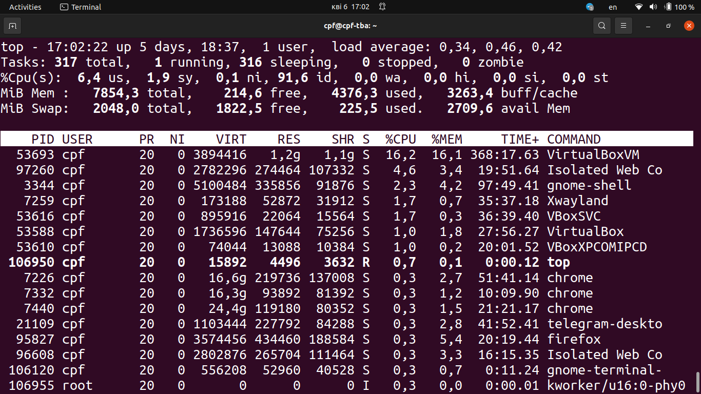

**Columns Headers**

| Header  | Comment                                                                                                                                               |
| :------ | :---------------------------------------------------------------------------------------------------------------------------------------------------- |
| PID     | Process Id. The task's unique process ID.                                                                                                             |
| USER    | User Name. The effective user name of the task's owner.                                                                                               |
| PR      | Priority. The scheduling priority of the task. `rt' means the task is running under real time scheduling priority.                                    |
| NI      | Nice Value of the task. A negative nice value means higher priority, a positive nice value - lower priority. Zero - priority not adjusted             |
| VIRT    | Virtual Memory Size (KiB). The total amount of virtual memory used by the task.                                                                       |
| RES     | Resident Memory Size (KiB). A subset of the virtual address space (VIRT) representing the non-swapped physical memory a task is currently using.      |
| SHR     | Shared Memory Size (KiB). A subset of resident memory (RES) that may be used by other processes.                                                      |
| S       | Process Status: D=uninterruptible sleep, I=idle, R=running, S=sleeping, T=stopped by job control signal, t=stopped by debugger during trace, Z=zombie |
| %CPU    | CPU Usage. The task's share of the elapsed CPU time since the last screen update, expressed as a percentage of total CPU time.                        |
| %MEM    | Memory Usage (RES). A task's currently resident share of available physical memory.                                                                   |
| TIME+   | CPU Time, hundredths of a second. Total CPU time the task has used since it started.                                                                  |
| COMMAND | Command Name or Command Line. Display the command line used to start a task or the name of the associated program.                                    |

11. Display the processes of the specific user using the top command.

`top -u <username or UID>`

Flags '-u' and '-U' allow to display only processes with a user id or user name matching that given.
The `-u' option matches on effective user whereas the `-U' option matches on any user (real, effective, saved, or filesystem).

Example:

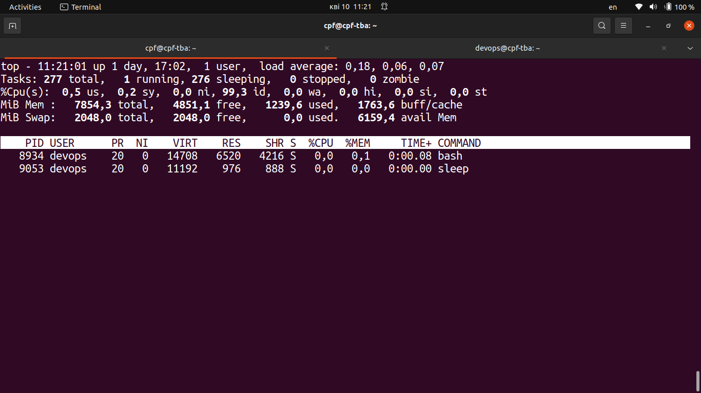

12. What interactive commands can be used to control the top command? Give a couple of
    examples.

When `top` command is run, one can press 'h' or '?' keys to see help for available Interactive Commands. Several examples of interactive commands are listed below:

- '1' (numerical 1): Toggle between total values and displaying all your CPU cores

- 'u': Display tasks for just one username

- 'Shift + V': switch to 'forest view' aka tree view

- 'Shift + H': Show threads

- 'Shift + W': Save your top configuration

- 'Shift + Z': Configure colors

- 'n': Set max tasks displayed

- 'k': Manipulate tasks: kill

- 'r': Manipulate tasks: renice

- 'c': display absolute path of command

- 'Shift + F': Add/remove/order/sort configurations:

  'arrows up/down' - navigate through the list of columns

  's' - set selected sort field

  'right arrow' + 'arrows up/down' - move order of columns

  'd' - make a columns visible/unvisible

13. Sort the contents of the processes window using various parameters (for example, the amount of processor time taken up, etc.)

Shortcuts for sort the contents of the processes window:

- `Shift + N` - sort by PID

- `Shift + P` - sort by CPU usage

- `Shift + M` - sort by Memory usage

- `Shift + T` - sort by Time usage

Alternative way of sorting:

- press 'x' and then press 'b'
- select column to be sorted with '<' or '>' signs
- to reverse sorting, press 'R'.

14. Concept of priority, what commands are used to set priority?

Command `nice` runs a program with modified scheduling priority. Run COMMAND with an adjusted niceness, which affects process scheduling. With no COMMAND, print the current niceness. Niceness values range from -20 (most favorable to the process) to 19 (least favorable to the process).

`nice [OPTION] [COMMAND [ARG]]`

Command `renice` alters priority of running processes. Renice alters the scheduling priority of one or more running processes. The first argument is the priority value to be used. The other arguments are interpreted as process IDs (by default), process group IDs, user IDs, or user names. Reniceing a process group causes all processes in the process group to have their scheduling priority altered. Reniceing a user causes all processes owned by the user to have their scheduling priority altered.

`renice [-n] priority [-g|-p|-u] identifier`

Example. The following command would change the priority of the processes with PIDs 987 and 32, plus all processes owned by the users daemon and root:

`renice +1 987 -u daemon root -p 32`

15. Can I change the priority of a process using the top command? If so, how?

Here is the instruction for change of the priority of a process using the `top` command:

- Start top with root privileges: `sudo top`
- The slow processes are at the top of the list.
- Type 'r' and now enter the PID and press enter.
- Enter your value to adjust CPU consumption (-20 = Highest Priority, 19 = Lowest Priority).
- Press enter to save.

16. Examine the kill command. How to send with the kill command process control signal? Give
    an example of commonly used signals.

Command `kill` sends a signal to a specified process, to all members of a specified process group, or to all processes on the system.
The default signal for kill is SIGTERM. Use -l or -L to list available signals.

Particularly useful signals include SIGHUP, SIGINT, SIGKILL, SIGSTOP, SIGCONT, and 0. Alternate signals may be specified in three ways: -9, -SIGKILL or -KILL. Negative PID values may be used to choose whole process groups; see the PGID column in ps command output. A PID of -1 is special; it indicates all processes except the kill process itself and init.

- SIGHUP (1) - Hangup detected on controlling terminal or death of controlling process

- SIGINT (2) - Interrupt from keyboard

- SIGKILL (9) - Kill signal forcebly

- SIGTERM (15) - Termination signal

- SIGCONT (18) - Continue if stopped

- SIGSTOP (19) - Stop process

EXAMPLES:

`kill -9 -1` - Kill all processes you can kill.

`kill -L` - List the available signal choices in a nice table.

`kill 123 543 2341 3453` - Send the default signal, SIGTERM, to all those processes.

`pkill -15 sleep` - Terminate processes referenced by name.

17. Commands jobs, fg, bg, nohup. What are they for? Use the sleep, yes command to
    demonstrate the process control mechanism with fg, bg.

Command `sleep <number>` means delay for a specified amount of time (by default <number> is set in seconds). Example: `sleep 600` starts foreground process, while `sleep 600 &` starts background process and shows PID in addition to jobs id.

In order to terminate foreground process enter `^C`. In order to shift backfround process into foreground process enter `fg %<jobid>`.

User is not able to interact with background process.
In order to shift foreground process into backfround process first enter `^Z` and then `bg %<jobid>`.

We can see the process with command `ps <PID>`.

Examples of the above commands are shown in below screenshot.

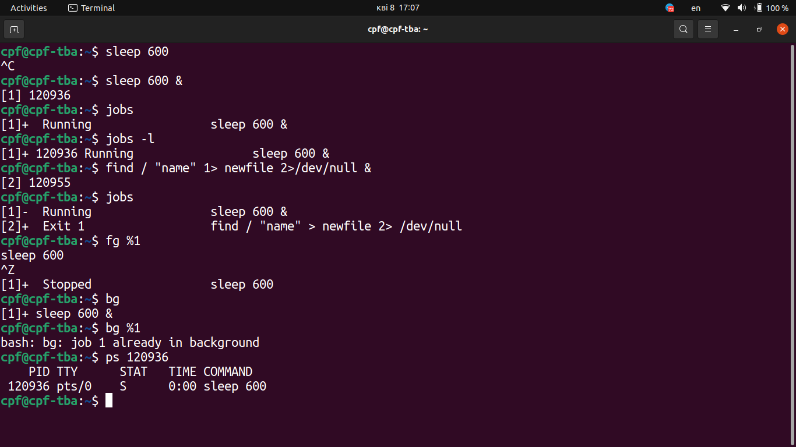

Shell processes are related to TTY. This can be shown with command `pstree -s <PID>`. So if TTY is closed, the started prosess (`sleep 600 &` in our case) is killed authomatically (SIGHUP signal). One can open new terminal and check that process is gone with command `ps -C sleep`.

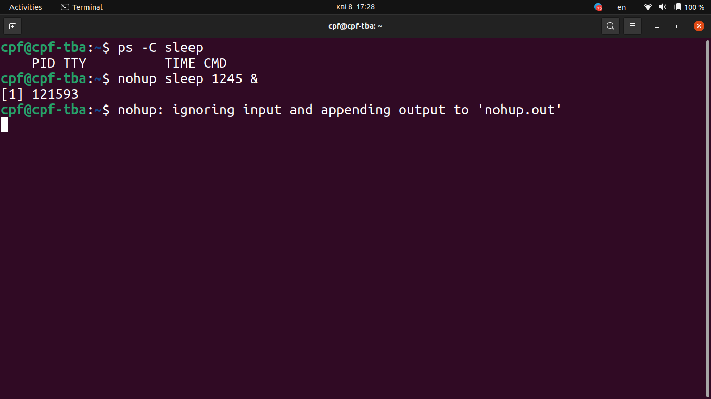

However, we can keep the process running (even in case TTY is closed) if `nohup` command is added: (`nohup sleep 1245 &`). This command prevents the processes to receive SIGHUP signal and runs a process command immune to hangups with output to a non-tty.

While `jobs` shows the processes running in current terminal, `ps -C sleep` shows all processes insluding those not related to the specific terminal (question mark in TTY column).

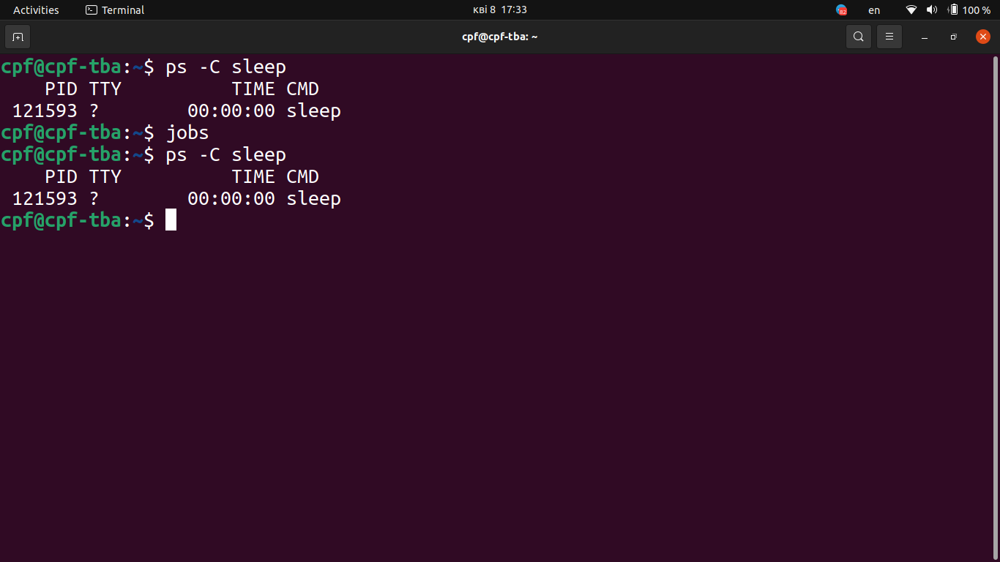

Command `yes <string>` outputs a string repeatedly until killed.

### Part 2

1. Check the implementability of the most frequently used OPENSSH commands in the MS
   Windows operating system. (Description of the expected result of the commands +screenshots: command – result should be presented)

`ssh-keygen` - generarate RSA key pair for passwordless ssh to server (guest VM - bridged network)

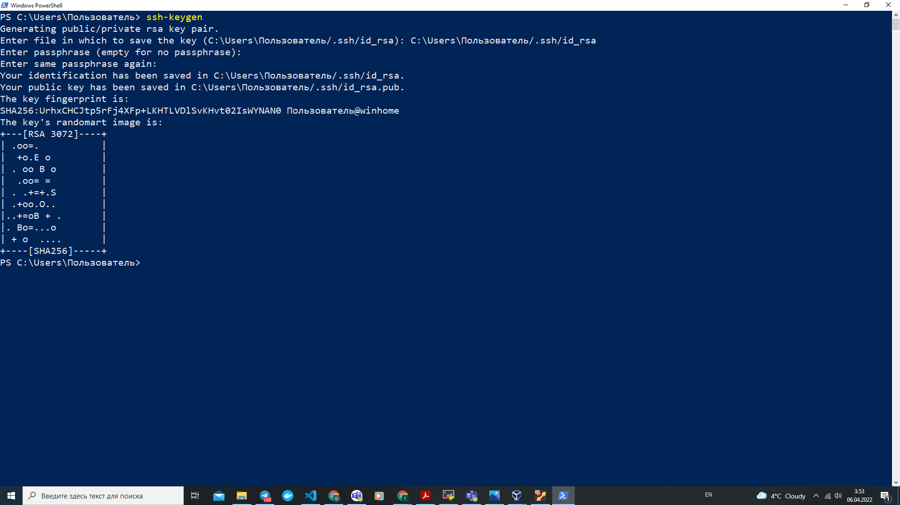

`scp $HOME/gena/.ssh/bridged_id_rsa.pub gm@192.168.1.69:~/.ssh/authorized_keys` - copy bridged_id_rsa.pub to server (guest VM - bridged network)

`ssh gm@192.168.1.69` - ssh connection to server: password requested

`ssh gm@uvm-bridged` - ssh connection to server: password requested

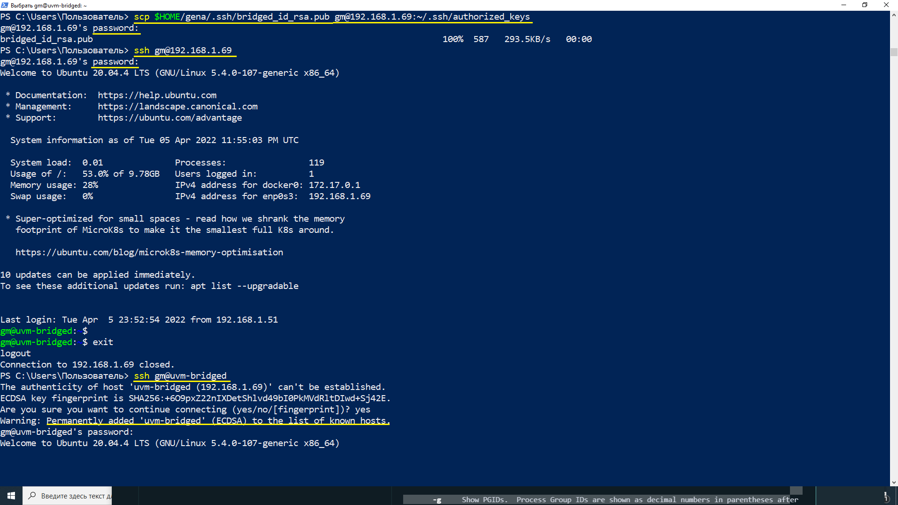

`ssh -i $home/Gena/.ssh/bridged_id_rsa gm@uvm-bridged` - ssh connection to server (with RSA secret key): passphrase requested

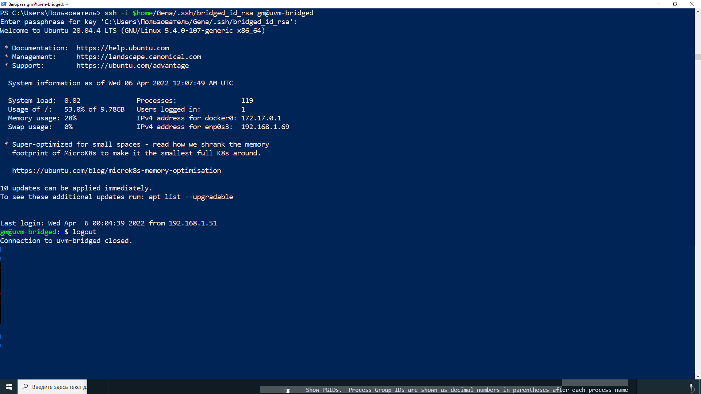

2. Implement basic SSH settings to increase the security of the client-server connection (at
   least)

Security Measures when SSH is used:

- Minimize permissions: `chmod 0700 $HOME/.ssh` - only owner may access the .ssh hidden directory.
- Use passwords based authentication or public key based authentication (with or withour passphrase).
- Configure ssh-keygen options: specifies number of bits in the key (which '-t') and type of key (with '-t').
- Configure the Ubuntu Linux firewall (ufw).
- Do not disclose the secret key.

3. List the options for choosing keys for encryption in SSH. Implement 3 of them.

Option '-t' of `ssh-keygen` command specifies the type of key to create.The possible values are “dsa”, “ecdsa”, “ecdsa-sk”, “ed25519”, “ed25519-sk”, or “rsa”.

`ssh keygen -t <dsa | ecdsa | ecdsa-sk | ed25519 | ed25519-sk | rsa>`

4. Implement port forwarding for the SSH client from the host machine to the guest Linux
   virtual machine behind NAT.

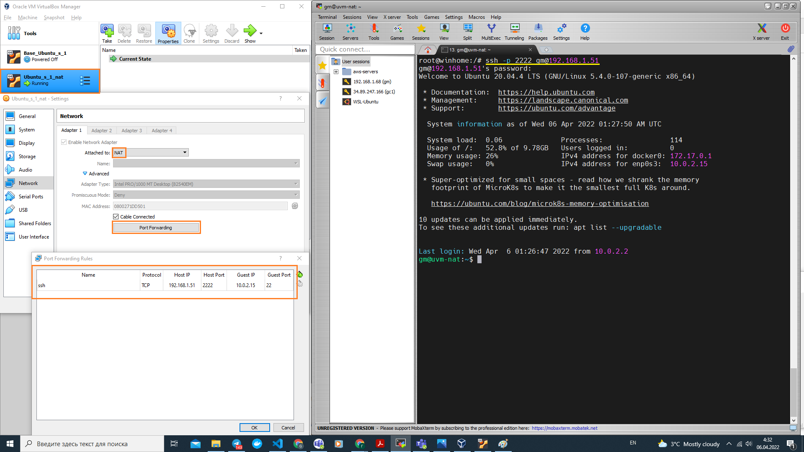

5. \*Intercept (capture) traffic (tcpdump, wireshark) while authorizing the remote client on the
   server using ssh, telnet, rlogin. Analyze the result.
