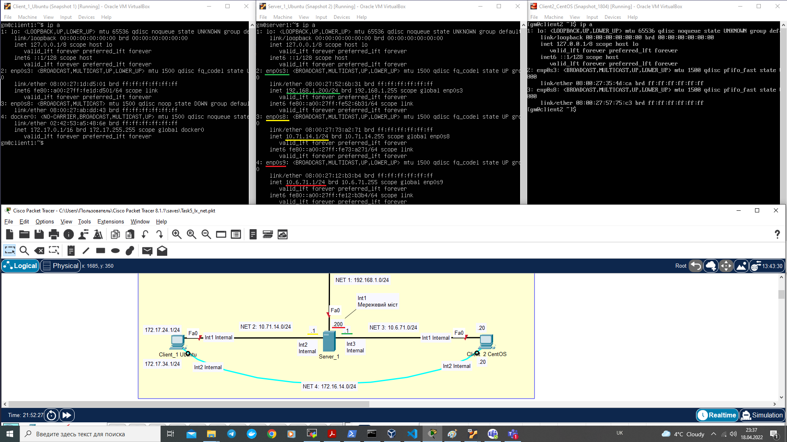

# Module 5. Linux Networking

## TASK 5

### **Logical schema of Local Network used in this Task 5**

1. Set static ip addresses on all interfaces of Server_1.

Server_1 network interfaces with static IP addresses:

| Interface ID | VM Adapter Type | Static IP Address | Subnet |
| :----------- | :-------------- | :---------------- | :----- |
| enp0s3       | bridged         | 192.168.1.200     | Net 1  |
| enp0s8       | internal        | 10.71.14.1        | Net 2  |
| enp0s9       | internal        | 10.6.71.1         | Net 3  |

Step 1. Configure '/etc/netplan/00-installer-config.yaml' file (Ubuntu 20.04).

Step 2. Activate changes with `sudo netplan try` and 'Enter'.

Step 3. Check server ip addresses with `ip a`.

Screenshot of the resuts:

2. Configure DHCP service on Server_1, which service shall dynamically provide IP addresses for Int1 of Client_1 and Client_2.

Step 1. Install on Server_1 dhcpd:

`sudo apt install isc-dhcp-server`

Step 2. Edit configuration at '/etc/dhcp/dhcpd.conf' file

Step 3. Restart dhcpd service:

`sudo systemctl restart isc-dhcp-server.service`

Step 4. Check dinamic IP addresses on Client_1 and Client_2

Screenshot of the resuts:

3. Check connection between virtual machines with 'ping' and 'traceroute' commands. Explane the result.

Attention! In order that packets from Client_1 та Client_2 can pass to the Internet (or, more accurately, cat return from the Internet to Client_1 and Client_2), it is required that static routes for Net2 and Net3 be configured on Wi-Fi Router.

Screenshot of the resuts:

4. Assign two ІР addresses on virtual interface 'lo' of Client_1 as follows: 172.17.D+10.1/24 and 172.17.D+20.1/24. Configure routing in such manner that traffic from Client_2 to 172.17.D+10.1 pass through Server_1, and to 172.17.D+20.1 - through Net4. Use 'traceroute' to check.

Step 1. Assign (temporarily) ІР addresses to interface 'lo' with command:

`sudo ip a add 172.17.24.1/255.255.255.0 dev lo`
`sudo ip a add 172.17.34.1/255.255.255.0 dev lo`

Step 2. Configure routing on Server_1 and Client_2:

`sudo ip route add 172.17.24.1/24 via 10.71.14.10` # on Server_1

`sudo ip route add 172.17.34.1/24 via 172.16.14.10` # on Client_2

Step 3. Check routing tables with:

`route -n`

Step 4. Ping and traceroute addresses 172.17.24.1 and 172.17.34.1 from Client_2:

NOTE: As 'traceroute 172.17.24.1' command did not work properly from Client_2, 'ping' command on CLient_2 (see TTL value) and 'tcpdump' command on Server_2 have been used to show that traffic from Client_2 to Client_1 (ping 172.17.24.1) pass through Server_2. Despite this problem with traceroute command, 'mtr' command (not shown on screenshot) did work properly showing 2 hop and trafic through Server_2.

Screenshot of the resuts:

5. Calculate summerizing address and mask of IP addresses 172.17.D+10.1 and 172.17.D+20.1. Mask shall be as broad as possible. Delete routes set on previous step and replace them with joint route passing through Server_1.

Step 1. Summarize routes 172.17.24.1 and 172.17.34.1, both attached to 'lo' interface on Client_1:

| IPv4 address | IP address in 32 bits                   |
| :----------- | :-------------------------------------- |
| 172.17.24.1  | **10101100.00010001.00**011000.00000001 |
| 172.17.34.1  | **10101100.00010001.00**100010.00000001 |

Common part: 172.17.0.0/18 (first 18 bold digits)

Mask: 255.255.192.0

Step 2. Change IP routing table on Server_1:

`sudo ip route del 172.17.24.1/24 via 10.71.14.10`

`sudo ip route add 172.17.0.0/18 via 10.71.14.10`

Step 3. Change IP routing table on Client_2:

`sudo ip route del 172.17.34.1/24 via 172.16.14.10`

Step 4. Check modified routing tables with:

`route -n`

Step 5. Ping and traceroute/mtr addresses 172.17.24.1 and 172.17.34.1 from Client_2:

Comment: See NOTE re 'traceroute' command in item 4 above.

Screenshots of the resuts:

6. Configure SSH service so that Client_1 and Client_2 be able to connect to Server_1 and to each other.

Screenshot 1: Both Client_1 and Client_2 are connected to Server_1 through SSH simultainiously

Screenshot 1:

- Client_1 is connected to and then disconnected from Client_2

- Client_2 is connected to Client_1

7. Configure firewall on Server_1 as follows:

   • connection through SSH shall be allowed from Client_1, but shall be prohibited from Client_2

   • ping from Client_1\* shall pass on 172.17.D+10.1, but shall not pass on 172.17.D+20.1

\*NOTE: as both addresses (172.17.D+10.1, 172.17.D+20.1) are set on interface 'lo' of Client_1, pings presumably cannot pass through Server_1. Therefore, this assignment is done presuming that pings shall pass from Client_2 (instead of Client_1).

Step 1. Configure Server_1 iptables: table 'filter', chain 'INPUT' to add rules re SSH connections

Step 2. Configure Server_1 iptables: table 'filter', chain 'FORWARD' to add rules re pings from Client_2 passing through Server_1

Screenshot of the resuts:

8. If the routing for Client_1's and Client_2's access to Internet has been configured as per item 3 above, remove respective records. Configure NAT service on Server_1 so that Client_1 and Client_2 be able to ping the Internet.

Step 1. Check ping to the Internet from Client_1 and Client_2 with earlier static routing configurations on home WiFi Router.

Step 2. Check ping to the Internet from Client_1 and Client_2 after removing abovementioned records on home WiFi Router.

Step 3. Configure NAT(PAT) service on Server_1 for Client_1 and Client_2.

`iptables -t nat -A POSTROUTING -s 10.0.0.0/8 -j SNAT --to-source 192.168.1.200`

Step 4. Check ping to the Internet from Client_1 and Client_2 configure of PAT service on Server_1.

