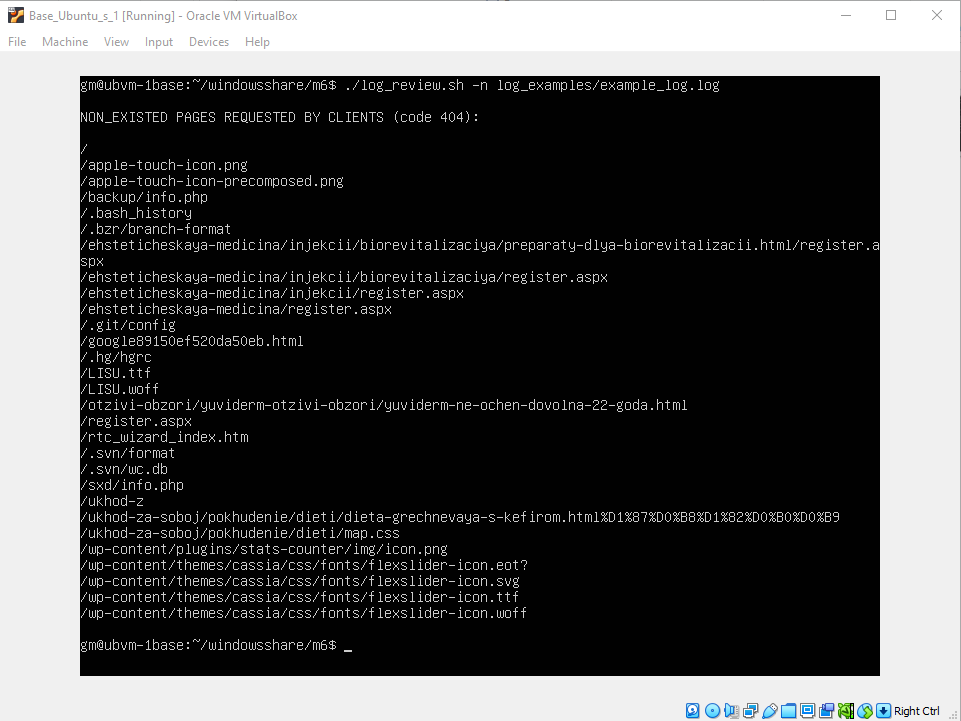

# Module 6. Linux administration with bash

## TASK 6

### Part A. Create a script that uses the following keys:

1. When starting without parameters, it will display a list of possible keys and their description.
2. The --all key displays the IP addresses and symbolic names of all hosts in the current subnet
3. The --target key displays a list of open system TCP ports.
   The code that performs the functionality of each of the subtasks must be placed in a separate function

Script `subnet.sh` is developed to solve the above problems of this Part A.

Screenshot below shows results of the commands:

`./subnet.sh`, `./subnet.sh --all` and `./subnet.sh --target`.


To review the code of 'subnet.sh' click [here](subnet.sh).

### Part B. Using Apache log example create a script to answer the following questions:

1. From which ip were the most requests?
2. What is the most requested page?
3. How many requests were there from each ip?
4. What non-existent pages were clients referred to?
5. What time did site get the most requests?
6. What search bots have accessed the site?

Script `log_review.sh` is developed to help analyzing Apache access log files in the following format:

`%h %l %u %t \"%r\" %>s %b \"%{Referer}i\" \"%{User-agent}i\"` also known as 'Combined Log Format'

**Example of a log record:**

```
127.0.0.1 - frank [10/Oct/2000:13:55:36 -0700] "GET /apache_pb.gif HTTP/1.0" 200 2326
"http://www.example.com/start.html" "Mozilla/4.08 [en] (Win98; I ;Nav)"
```

where:

(%h) 127.0.0.1 - IP address of the client (remote host) which made the request to the server

(%l) - The "hyphen" in the output indicates that the requested piece of info (identd) is not available.

(%u) frank - userid of the person requesting the document as determined by HTTP authentication. If the document is not password protected, this part will be "-" just like the previous one.

(%t) [10/Oct/2000:13:55:36 -0700] - The time that the request was received. The format is:
[day/month/year:hour:minute:second zone]

(\"%r\") "GET /apache_pb.gif HTTP/1.0" - The request line from the client, contining the method 'GET', the resource '/apache_pb.gif', and the protocol 'HTTP/1.0'.

(%>s) 200 - the status code that the server sends back to the client

(%b) 2326 - the size of the object returned to the client, not including the response headers. If no content was returned to the client, this value will be "-"

(\"%{Referer}i\") "http://www.example.com/start.html" - the page that links to or includes '/apache_pb.gif'

\"%{User-agent}i\" "Mozilla/4.08 [en] (Win98; I ;Nav)" - User-Agent: the identifying information that the client browser reports about itself.

Script `log_review.sh` takes two or more parameters - it takes, first, one or several options (see table below), and then, the name of the log file (if it is in the same directory with the script) or full path to the log file. Script checks that the log file is not empty and the log file format is consistant with the Combined Log Format (see above). Help information is shown if -h option is applied.

**Options in below table may be combined, like '-art' or '-a -p -t':**

| Problem                                                        | Option to be used |
| :------------------------------------------------------------- | :---------------: |
| to check from which ip [a]ddress were the most requests        |        -a         |
| to see how many [r]equests were there from each ip             |        -r         |
| to analize what is the most requested [p]age                   |        -p         |
| to discover what [n]on-existent pages were clients referred to |        -n         |
| to find out what [t]ime did site get the most requests         |        -t         |
| to investigate what search [b]ots have accessed the site       |        -b         |

Below screenshot displays the command `./log_review.sh -r log_examples/apache_logs.txt` in action:


Below screenshot displays command `./log_review.sh -aptbn log_examples/apache_logs.txt` in action:


Below screenshot displays command `./log_review.sh -n log_examples/example_log.log` in action:



Below screenshot displays command `./log_review.sh -h` in action:


To review the code of 'log_review.sh' click [here](log_review.sh).

### Part C. Create a data backup script that takes the following data as parameters:

1. Path to the syncing directory.
2. The path to the directory where the copies of the files will be stored.
   In case of adding new or deleting old files, the script must add a corresponding entry to the log file indicating the time, type of operation and file name. [The command to run the script must be added to crontab with a run frequency of one minute]

Problems specified in this Part C are resolved two separate scripts 'config.sh' and 'backup.sh' with crontab configuration added to run the latter.

First script 'config.sh' is run by user manually with two mandatory parameters:

- SYNC_DIRECTORY : path to the syncing directory (first parameter)

- BACKUP_DIRECTORY : path to the directory where the copies of the files will be stored (second parameter)

After verification of the parameters, configuration file "config.txt" is created in the home directory of the user.

Second script 'backup.sh' is run by crontab with an established frequency configured in crontab (in this case - one minute). This script loads paths to the syncing directory and the backup directory from the configutation file "config.txt". Then it compiles the uniq list of files located in both the syncing directory and backup directory and itereates over this list as follows:

- if file in the list is in the syncing directory only, it is added to the backup directory;
- if file in the list is in the backup directory only, it is removed from the backup directory;
- if file in the list is in both directories, it is updated(copied) in the backup directory provided the file in syncing directory is newer than the eponymous file in the backup directory.

In case of successful adding, updating or deleting files in the backup directory, respective records are added to the logfile kept by default in user's home directory.

The below screenshot shows (1) creation of the configuration file "config.txt" with `./config.sh ./log_examples $HOME/backups` command and (2) manually running the 'backup.sh' script:


Crontab configuration and action for 'backup.sh' script (run script infinitely with one minute delay):


To review the code of 'config.sh' file click [here](config.sh).

To review the code of 'backup.sh' file click [here](backup.sh).
