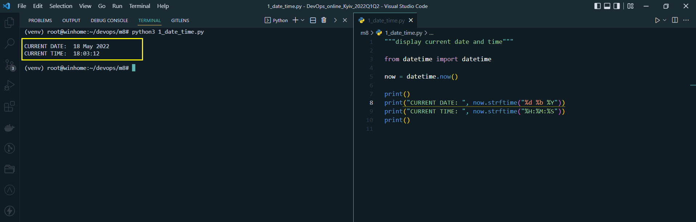
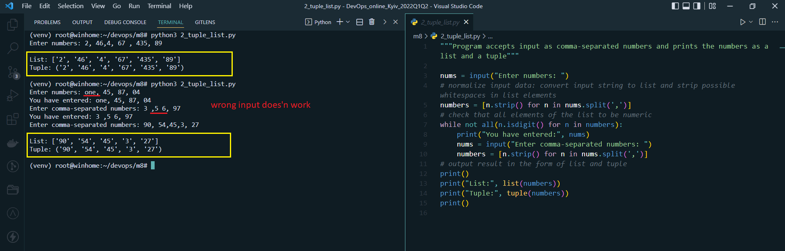
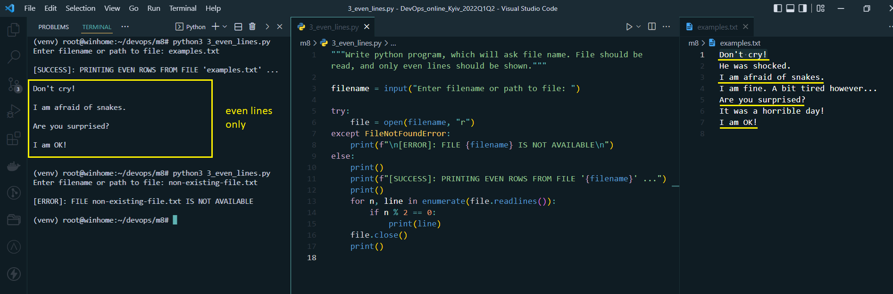
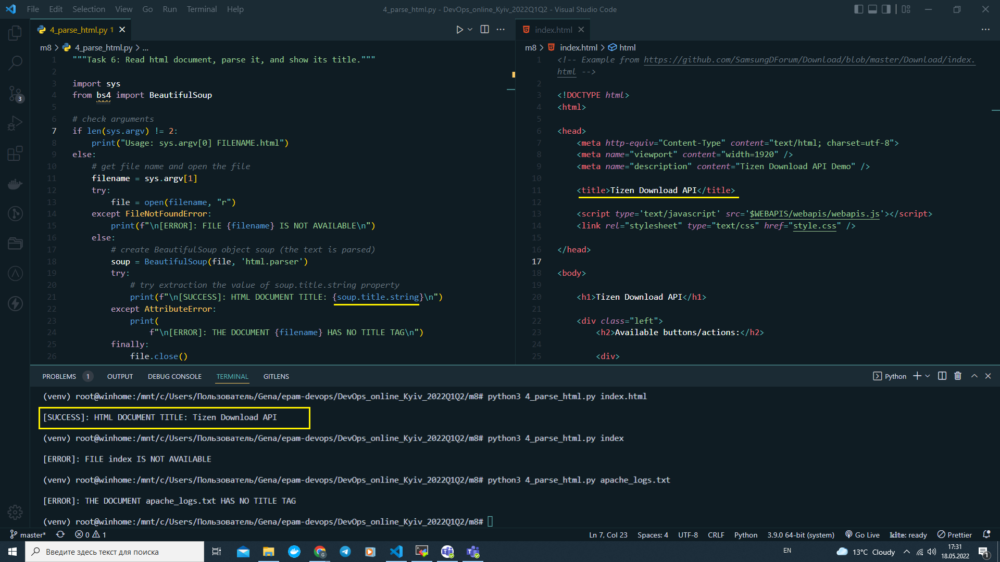
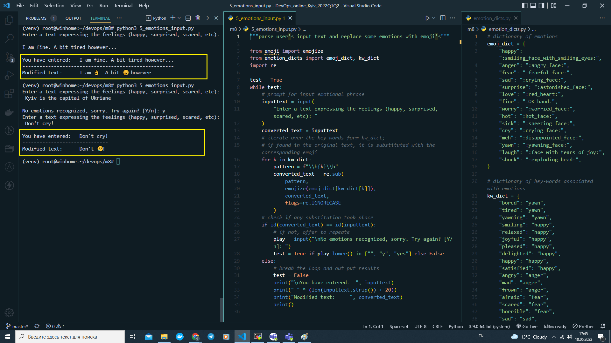
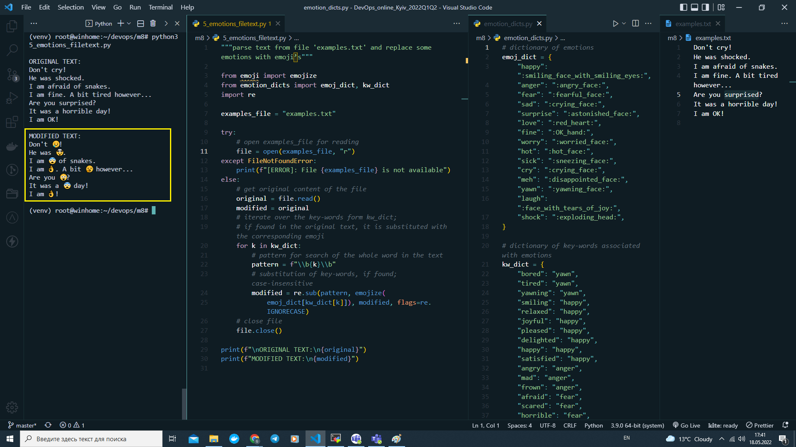
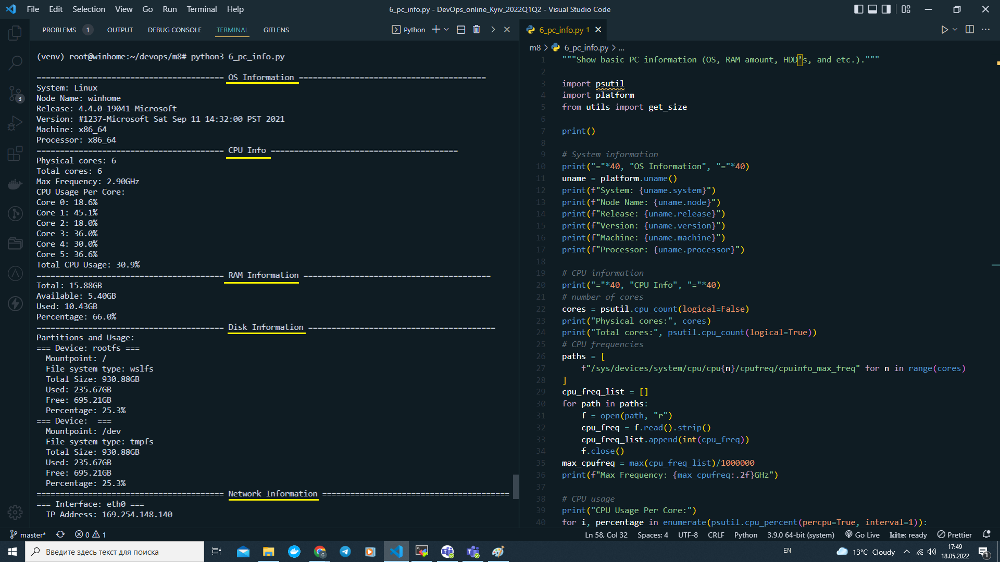

# Module 8. Python intro

## TASK 8.1

### PART 1

1. Write easy program, which will display current date and time.

#### The below screenshot shows the output of Python program [1_date_time.py](1_date_time.py):

2. Write python program, which will accept comma-separated numbers, and then it should write tuple and list of them:

   Enter numbers: 1, 2, 7, 43, 9
   Output:
   List: [‘1’, ‘2’, ‘7’, ‘43’, ‘9’]
   Tuple: (‘1’, ‘2’, ‘7’, ‘43’, ‘9’)

#### The below screenshot shows the output of Python program [2_tuple_list.py](2_tuple_list.py):

3. Write python program, which will ask file name. File should be read, and only even lines should be shown.

#### The below screenshot shows the output of Python program [3_even_lines.py](3_even_lines.py):

4. Write python program, which should read html document, parse it, and show it’s title.

#### The below screenshot shows the output of Python program [4_parse_html.py](4_parse_html.py):

5. Write python program, which will parse user’s text, and replace some emotions with emoji’s (Look: pip install emoji).

Two variations of the programm are show below: first - when string is entered as input; second - when text is read from file. Used dependencies: 'emoji'.

#### The below screenshot shows the output of Python program [5_emotions_input.py](5_emotions_input.py):

#### The below screenshot shows the output of Python program [5_emotions_filetext.py](5_emotions_filetext.py):

6. Write program, that will show basic PC information (OS, RAM amount, HDD’s, and etc.).

#### The below screenshot shows the output of Python program [6_pc_info.py](6_pc_info.py):

